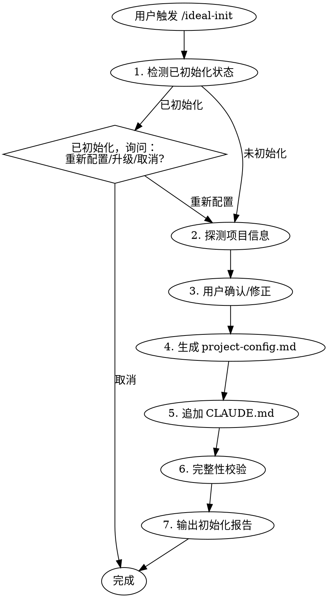

# P1-需求文档：ideal-init skill 优化 - 职责重构与功能补全

## 一、重构背景

### 1.1 当前状态

`ideal-init` Skill 定义了 9 步交互式流程，但存在以下问题：

1. **功能未实现**：项目探测、配置生成等核心功能仅有文档定义，无实际实现
2. **职责不清**：与 CLI init 边界模糊，都做"项目初始化"
3. **流程冗余**：9 步流程包含全局资源检查、目录创建等应由 CLI 处理的工作

### 1.2 存在的问题

| 问题类型 | 具体描述 | 影响 |
|----------|----------|------|
| 功能缺失 | 项目探测逻辑未实现 | 用户无法获得智能配置 |
| 职责越界 | 包含全局资源检查、目录创建 | 与 CLI 职责重叠 |
| 流程冗余 | 9 步流程过于复杂 | 用户体验差 |
| 文档过时 | SKILL.md 描述与实际行为不符 | 维护负担 |

### 1.3 重构目标

1. **明确职责**：Skill 只负责需要 AI 的智能操作
2. **补全功能**：实现项目探测、配置生成等核心功能
3. **简化流程**：移除不属于 Skill 职责的步骤

---

## 二、重构范围

### 2.1 涉及模块

| 模块名称 | 当前职责 | 重构后职责 |
|----------|----------|------------|
| `.claude/skills/ideal-init/SKILL.md` | 9 步流程定义 | 简化为智能操作流程 |
| `.claude/skills/ideal-init/references/` | 模板和规则 | 更新探测规则和配置模板 |

### 2.2 不涉及的模块

- `src/commands/init.ts`（CLI init）- 另行需求处理
- 全局资源管理（`~/.claude/`）- 另行需求处理
- 目录结构创建 - 另行需求处理
- 其他 Skills 和 Agents

---

## 三、重构方案

### 3.1 方案概述

**核心原则：Skill 只做需要 AI 的智能操作**

```
┌─────────────────────────────────────────────────────────────┐
│                    ideal-init Skill                         │
│                    （AI 智能操作）                           │
├─────────────────────────────────────────────────────────────┤
│  ✓ 已初始化检测                                              │
│  ✓ 项目探测（语言、框架、Git 等）                             │
│  ✓ 用户确认/修正探测结果                                     │
│  ✓ 生成/优化 project-config.md                              │
│  ✓ 追加 CLAUDE.md 工作流说明                                 │
│  ✓ 完整性校验                                                │
├─────────────────────────────────────────────────────────────┤
│  ✗ 全局资源下载（CLI 负责）                                   │
│  ✗ 目录结构创建（CLI 负责）                                   │
│  ✗ agents/skills 安装（CLI 负责）                            │
└─────────────────────────────────────────────────────────────┘
```

### 3.2 职责边界

| 功能 | 负责方 | 说明 |
|------|--------|------|
| 全局资源下载 | CLI | 下载 agents/skills 到 `~/.claude/` |
| 目录结构创建 | CLI | 创建 `docs/迭代/`、`docs/Wiki/` 等 |
| 已初始化检测 | **Skill** | 检查项目是否已接入工作流 |
| 项目探测 | **Skill** | 探测语言、框架、Git 等信息 |
| 配置生成 | **Skill** | 生成/优化 `project-config.md` |
| CLAUDE.md 追加 | **Skill** | 在现有文件末尾追加工作流说明 |
| 完整性校验 | **Skill** | 检查依赖、配置是否完整 |

### 3.3 Skill 工作流



### 3.4 详细设计

#### 3.4.1 Step 1: 已初始化检测

**检测逻辑**：
- 检查 `.claude/project-config.md` 是否存在
- 检查文件中是否包含 CC-Workflow 相关配置

**已初始化时的处理**：
```
检测到项目已接入 CC-Workflow（初始化时间：{date}）

请选择操作：
1. 重新配置 - 重新探测项目信息并生成配置
2. 取消 - 保持现有配置
```

#### 3.4.2 Step 2: 项目探测

**探测项**：

| 探测项 | 检测方式 | 用途 |
|--------|----------|------|
| 项目名称 | package.json / Git URL / 目录名 | 填充配置 |
| 语言类型 | 特征文件检测 | 选择命令模板 |
| 框架 | 依赖分析 | 填充技术栈 |
| Git 状态 | .git 目录检测 | 填充 Git 配置 |
| 主分支 | git rev-parse | 填充分支配置 |
| 测试命令 | 推断或读取配置 | 填充执行配置 |
| 构建命令 | 推断或读取配置 | 填充执行配置 |

**特征文件映射**：

| 特征文件 | 语言 | 测试命令 | 构建命令 |
|----------|------|----------|----------|
| `package.json` | Node.js | `npm test` | `npm run build` |
| `requirements.txt` / `pyproject.toml` | Python | `pytest` | `python setup.py build` |
| `go.mod` | Go | `go test ./...` | `go build` |
| `pom.xml` / `build.gradle` | Java | `mvn test` | `mvn package` |

#### 3.4.3 Step 3: 用户确认

**展示探测结果**：

```
📊 项目探测结果：

| 项目 | 探测值 |
|------|--------|
| 项目名称 | {name} |
| 语言 | {language} |
| 框架 | {framework} |
| 测试命令 | {test_cmd} |
| 构建命令 | {build_cmd} |
| Git 仓库 | {git_repo} |
| 主分支 | {main_branch} |

以上信息是否正确？如需修改请告知。
```

#### 3.4.4 Step 4: 生成 project-config.md

基于探测结果和用户确认，生成 `.claude/project-config.md`。

**如果文件已存在**：
- 询问用户：覆盖 / 合并 / 跳过

#### 3.4.5 Step 5: 追加 CLAUDE.md

**处理方式**：追加模式（保留原有内容）

**追加内容**：

```markdown
---

## CC-Workflow 工作流集成

本项目已接入 CC-Workflow 工作流体系，实现从需求到上线的全流程自动化。

### 初始化信息

- **初始化时间**：{timestamp}
- **工作流版本**：{version}

### 工作流使用

| 命令 | 说明 |
|------|------|
| `/ideal-requirement` | 开始新需求（P1） |
| `/ideal-init` | 重新初始化项目配置 |
| `ideal status` | 查看当前流程状态 |

### 相关文档

- [项目配置](.claude/project-config.md)
- [流程状态](docs/项目状态.md)
```

**如果 CLAUDE.md 不存在**：创建完整文件

**如果 CLAUDE.md 已包含工作流说明**：询问是否更新

#### 3.4.6 Step 6: 完整性校验

**校验项**：

| 检查项 | 说明 | 处理 |
|--------|------|------|
| `.claude/project-config.md` | 项目配置文件 | 缺失则提示 |
| `CLAUDE.md` | Claude 指令文件 | 缺失则提示 |
| `docs/迭代/` | 迭代目录 | 缺失则提示 |
| `docs/Wiki/` | 文档目录 | 缺失则提示 |
| Git 初始化 | 是否为 Git 仓库 | 未初始化则提示 |

#### 3.4.7 Step 7: 输出初始化报告

```
✓ CC-Workflow 初始化完成

配置文件：
  ✓ 创建 .claude/project-config.md
  ✓ 更新 CLAUDE.md

探测结果：
  项目名称: {name}
  语言: {language}
  框架: {framework}
  测试命令: {test_cmd}
  构建命令: {build_cmd}

完整性校验：
  ✓ project-config.md 存在
  ✓ CLAUDE.md 存在
  ⚠ docs/迭代/ 目录不存在，请运行 `ideal init` 创建

后续步骤：
  1. 检查 .claude/project-config.md 确认配置正确
  2. 运行 /ideal-requirement 开始第一个需求
```

---

## 四、SKILL.md 结构调整

### 4.1 当前结构（9 步）

1. 确认目标路径
2. 检查全局配置
3. 安装/更新全局资源
4. 探测项目信息
5. 用户确认/修正
6. 扫描已有结构
7. 处理冲突文件
8. 生成项目结构
9. 输出初始化报告

### 4.2 重构后结构（7 步）

1. 已初始化检测
2. 探测项目信息
3. 用户确认/修正
4. 生成 project-config.md
5. 追加 CLAUDE.md
6. 完整性校验
7. 输出初始化报告

### 4.3 移除的步骤

| 原步骤 | 移除原因 |
|--------|----------|
| 确认目标路径 | 简化流程，默认当前目录 |
| 检查全局配置 | CLI 职责 |
| 安装/更新全局资源 | CLI 职责 |
| 扫描已有结构 | 简化流程，按需处理 |
| 处理冲突文件 | 简化流程，Step 4/5 单独处理 |

---

## 五、实施计划

### 5.1 实施步骤

| 步骤 | 内容 | 优先级 |
|------|------|--------|
| 1 | 重构 SKILL.md：简化流程结构 | P0 |
| 2 | 更新 references/detection-rules.md | P0 |
| 3 | 更新 references/templates/project-config.md.tmpl | P0 |
| 4 | 添加 references/templates/CLAUDE.md.appendix.md | P1 |

### 5.2 依赖关系

无外部依赖，可独立实施。

---

## 六、风险评估

### 6.1 技术风险

| 风险项 | 影响程度 | 发生概率 | 应对措施 |
|--------|----------|----------|----------|
| 项目探测不准确 | 中 | 中 | 提供用户修正机制 |
| CLAUDE.md 追加位置错误 | 低 | 低 | 检测已有标记避免重复 |

### 6.2 业务风险

| 风险项 | 影响程度 | 发生概率 | 应对措施 |
|--------|----------|----------|----------|
| 用户习惯改变 | 低 | 中 | 提供清晰文档 |

---

## 七、验收标准

### 7.1 功能验收

- [ ] SKILL.md 流程简化为 7 步
- [ ] 能检测项目是否已初始化
- [ ] 能探测项目信息（语言、框架、Git 等）
- [ ] 能生成/优化 project-config.md
- [ ] 能追加 CLAUDE.md 工作流说明
- [ ] 能进行完整性校验
- [ ] 能输出初始化报告

### 7.2 质量验收

- [ ] 职责边界清晰（不涉及 CLI 职责）
- [ ] 流程简洁，用户体验良好
- [ ] 文档与实现一致

---

*文档版本: v1.0*
*创建时间: 2026-02-27*
*作者: Claude Code*
