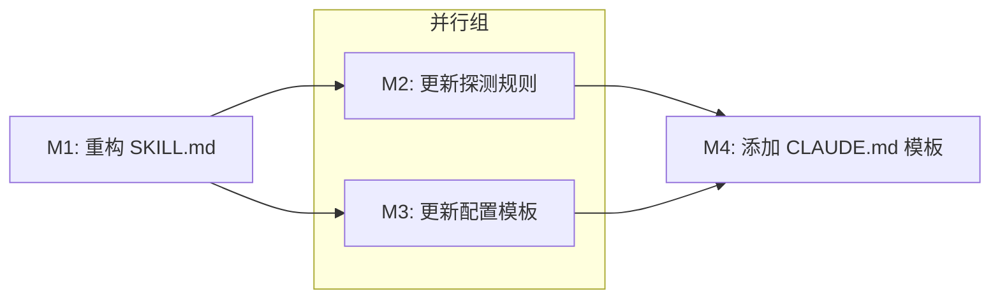

# P5-编码计划

> **For Claude:** REQUIRED SUB-SKILL: Use ideal-dev-exec to implement this plan task-by-task.

**Goal:** 重构 ideal-init Skill，将 9 步流程简化为 7 步，实现项目探测、配置生成、CLAUDE.md 追加等智能功能。

**Architecture:** 纯文档重构，修改 SKILL.md 和 references/ 目录下的模板文件。无代码实现，AI 直接按 SKILL.md 定义的流程执行。

**Tech Stack:** Markdown, YAML Front Matter, Claude Code Skill 架构

---

## 模块总览

| 模块编号 | 模块名称 | 任务数 | 优先级 | 执行策略 |
|----------|----------|--------|--------|----------|
| M1 | 重构 SKILL.md | 3 | P0 | sequential |
| M2 | 更新探测规则 | 2 | P0 | parallel |
| M3 | 更新配置模板 | 2 | P0 | parallel |
| M4 | 添加 CLAUDE.md 模板 | 1 | P1 | sequential |

**总任务数**: 8

---

## 依赖关系

**执行顺序**：
1. M1（必须先完成，定义流程规范）
2. M2、M3（可并行）
3. M4（依赖 M2、M3）

---

## M1: 重构 SKILL.md

### 任务 1.1: 移除 CLI 职责步骤

**目标**: 从 SKILL.md 中移除全局配置检查、目录创建等 CLI 职责步骤

**步骤**:
1. [ ] 读取现有 SKILL.md
2. [ ] 识别并移除以下步骤：
   - Step 1: 确认目标路径（简化处理）
   - Step 2: 检查全局配置（CLI 职责）
   - Step 3: 安装/更新全局资源（CLI 职责）
   - Step 6: 扫描已有结构（简化处理）
   - Step 7: 处理冲突文件（简化处理）
3. [ ] 验证移除后流程连贯

**验证标准**:
- [ ] SKILL.md 不再包含全局配置检查步骤
- [ ] SKILL.md 不再包含目录创建步骤
- [ ] 流程从 9 步简化为 7 步

### 任务 1.2: 重构为 7 步流程

**目标**: 将 SKILL.md 重构为新的 7 步流程结构

**步骤**:
1. [ ] 定义新的 7 步流程：
   - Step 1: 已初始化检测
   - Step 2: 项目探测
   - Step 3: 用户确认
   - Step 4: 生成 project-config.md
   - Step 5: 追加 CLAUDE.md
   - Step 6: 完整性校验
   - Step 7: 输出初始化报告
2. [ ] 为每步添加详细说明
3. [ ] 更新 Workflow 图

**验证标准**:
- [ ] SKILL.md 包含 7 个步骤
- [ ] 每个步骤有清晰的输入输出定义
- [ ] Workflow 图与步骤一致

### 任务 1.3: 更新 Quality Checklist

**目标**: 更新质量检查清单以匹配新流程

**步骤**:
1. [ ] 移除旧流程的检查项
2. [ ] 添加新流程的检查项
3. [ ] 更新 Common Mistakes 表格

**验证标准**:
- [ ] Checklist 包含所有 7 步的检查项
- [ ] 无过时的检查项

---

## M2: 更新探测规则

### 任务 2.1: 更新 detection-rules.md

**目标**: 更新项目探测规则以匹配新需求

**步骤**:
1. [ ] 读取现有 detection-rules.md
2. [ ] 添加特征文件映射表
3. [ ] 添加默认值定义
4. [ ] 添加探测失败处理策略

**验证标准**:
- [ ] 包含 Node.js、Python、Go、Java 的探测规则
- [ ] 每种语言有明确的测试/构建命令推断逻辑
- [ ] 定义了默认值

### 任务 2.2: 添加探测失败处理

**目标**: 添加探测失败时的处理策略

**步骤**:
1. [ ] 定义无法识别项目类型时的处理
2. [ ] 定义特征文件缺失时的处理
3. [ ] 定义 Git 未初始化时的处理

**验证标准**:
- [ ] 所有探测失败场景有处理策略
- [ ] 策略明确默认值

---

## M3: 更新配置模板

### 任务 3.1: 更新 project-config.md.tmpl

**目标**: 更新项目配置模板以支持新功能

**步骤**:
1. [ ] 读取现有模板
2. [ ] 添加初始化信息区块
3. [ ] 添加占位符变量
4. [ ] 确保 YAML Front Matter 格式正确

**验证标准**:
- [ ] 模板包含所有需要的占位符
- [ ] 格式与 Obsidian 兼容

### 任务 3.2: 添加 CLAUDE.md.appendix.md

**目标**: 创建 CLAUDE.md 追加内容模板

**步骤**:
1. [ ] 创建 templates/CLAUDE.md.appendix.md
2. [ ] 定义追加内容结构
3. [ ] 添加时间戳和版本占位符

**验证标准**:
- [ ] 文件存在
- [ ] 包含完整的追加内容结构
- [ ] 包含 {timestamp} 和 {version} 占位符

---

## M4: 添加 CLAUDE.md 模板

### 任务 4.1: 创建完整模板

**目标**: 创建 CLAUDE.md 完整模板（用于不存在 CLAUDE.md 的情况）

**步骤**:
1. [ ] 创建 templates/CLAUDE.md.full.tmpl
2. [ ] 包含基本项目指令结构
3. [ ] 包含工作流集成说明

**验证标准**:
- [ ] 文件存在
- [ ] 包含完整的项目指令模板

---

## 验证计划

### 完整流程验证

1. [ ] 模拟新项目初始化流程
2. [ ] 验证 7 步流程连贯性
3. [ ] 验证模板占位符正确填充
4. [ ] 验证 CLAUDE.md 追加逻辑

### 文档一致性验证

1. [ ] SKILL.md 与 references/ 内容一致
2. [ ] 模板占位符与探测规则对应
3. [ ] 流程图与步骤描述一致

---

*文档版本: v1.0*
*创建时间: 2026-02-27*
*作者: Claude Code*
