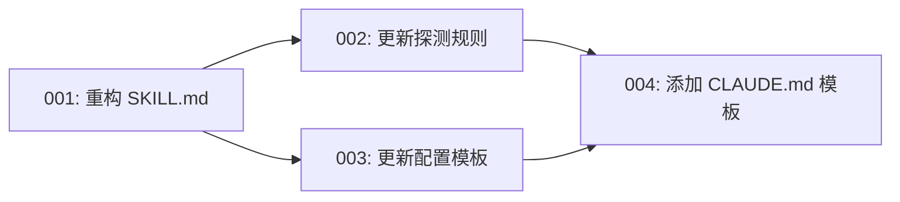

# 故事索引

## 概览

| 故事 | 标题 | 状态 | 依赖 |
|------|------|------|------|
| [001](001-重构SKILL.md) | 重构 SKILL.md | ✅ 已完成 | - |
| [002](002-更新探测规则.md) | 更新探测规则 | ✅ 已完成 | 001 |
| [003](003-更新配置模板.md) | 更新配置模板 | ✅ 已完成 | 001 |
| [004](004-添加CLAUDE.md模板.md) | 添加 CLAUDE.md 模板 | ✅ 已完成 | 002, 003 |

## 依赖关系

## 执行顺序

1. **001-重构SKILL.md**（必须先完成）
2. **002-更新探测规则**（可与 003 并行）
3. **003-更新配置模板**（可与 002 并行）
4. **004-添加CLAUDE.md模板**（依赖 002、003）

## 状态说明

- ⏳ 待开始
- 🔄 进行中
- ✅ 已完成
- ❌ 已阻塞
