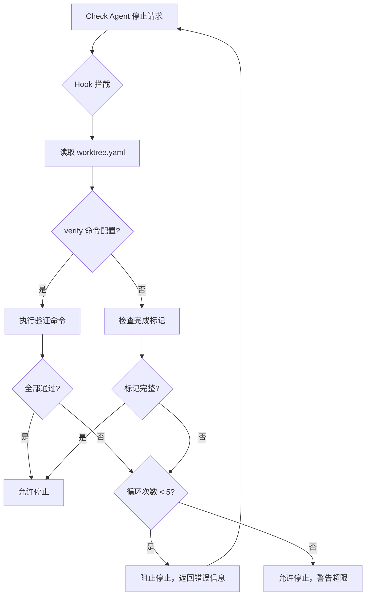
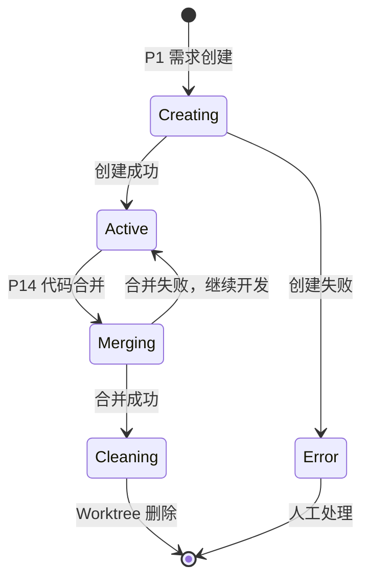
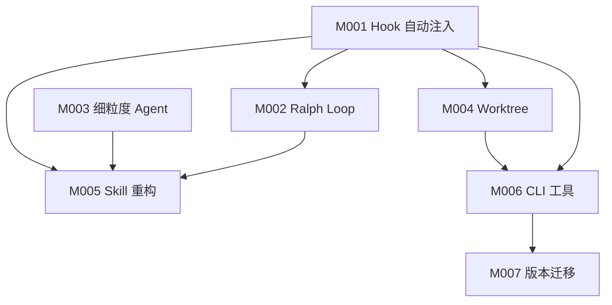

# P3-技术方案：CC-Workflow 工程化约束增强

## 一、方案概述

### 1.1 设计目标

本方案旨在将 Trellis 的工程化约束机制融入 CC-Workflow 的企业流程框架，实现以下核心目标：

| 目标 | 说明 |
|------|------|
| 确定性执行 | 从"软约束"改为"硬约束"，Hook 自动注入确保规范被遵循 |
| 真正的子 Agent 调用 | 使用 Task 工具替代注释扮演，实现上下文隔离 |
| 需求级别隔离 | P1 创建 Worktree，需求之间物理隔离 |
| 程序化质量保障 | Ralph Loop 确保验证命令通过才可结束 |

### 1.2 核心设计原则

| 原则 | 说明 |
|------|------|
| 最小侵入 | 新机制通过 Hook 注入，不改变现有 Skill 的核心逻辑结构 |
| 单一职责 | 新增的 4 个 Agent 各司其职，禁止跨职责操作 |
| 配置驱动 | jsonl 文件定义上下文，worktree.yaml 定义隔离配置 |
| 渐进增强 | 保留 16 阶段流程框架，通过 Hook 增强执行确定性 |

### 1.3 技术栈选型

| 层级 | 技术选型 | 选型理由 |
|------|----------|----------|
| Hook 脚本 | Python 3.10+ | Trellis 参考实现，生态成熟，Claude Code 原生支持 |
| 配置格式 | YAML + JSONL | YAML 用于 worktree.yaml（可读性好），JSONL 用于上下文配置（流式处理） |
| CLI 工具 | Node.js + TypeScript | Trellis 参考实现，npm 分发方便，跨平台兼容 |
| Agent 定义 | Markdown | 保持与现有架构一致，遵循 agents.md 协议 |

---

## 二、系统架构

### 2.1 整体架构图

```
┌─────────────────────────────────────────────────────────────────────────┐
│                           用户交互层                                      │
│  ┌─────────────┐    ┌─────────────┐    ┌─────────────┐                  │
│  │ /ideal:*    │    │ CLI 命令    │    │ Obsidian    │                  │
│  │ Slash 命令  │    │ ideal init  │    │ 文档编辑    │                  │
│  └──────┬──────┘    └──────┬──────┘    └──────┬──────┘                  │
└─────────┼──────────────────┼──────────────────┼──────────────────────────┘
          │                  │                  │
          ▼                  ▼                  ▼
┌─────────────────────────────────────────────────────────────────────────┐
│                           Skill 流程层                                    │
│  ┌───────────────────────────────────────────────────────────────────┐  │
│  │  ideal-requirement → ideal-dev-solution → ideal-dev-plan → ...   │  │
│  │  (P1)                (P3)                 (P5)                     │  │
│  └───────────────────────────────────────────────────────────────────┘  │
│                              │                                           │
│                              │ Task(subagent_type="xxx")                 │
│                              ▼                                           │
└─────────────────────────────────────────────────────────────────────────┘
          │
          ▼ PreToolUse Hook
┌─────────────────────────────────────────────────────────────────────────┐
│                        Hook 自动注入层（新增）                            │
│  ┌───────────────────────────────────────────────────────────────────┐  │
│  │  inject-context.py                                                 │  │
│  │  ├── 检测 subagent_type                                            │  │
│  │  ├── 读取 .current-task 定位需求目录                               │  │
│  │  ├── 读取 {故事名}.jsonl 上下文配置                                │  │
│  │  └── 注入文件内容到子 Agent prompt                                 │  │
│  └───────────────────────────────────────────────────────────────────┘  │
└─────────────────────────────────────────────────────────────────────────┘
          │
          ▼
┌─────────────────────────────────────────────────────────────────────────┐
│                           Agent 能力层                                    │
│  ┌──────────┐ ┌──────────┐ ┌──────────┐ ┌──────────┐ ┌──────────┐       │
│  │ pm       │ │architect │ │ implement│ │  check   │ │  debug   │       │
│  │ 需求梳理 │ │ 架构设计 │ │ 代码实现 │ │ 代码检查 │ │ 调试修复 │       │
│  └──────────┘ └──────────┘ └──────────┘ └──────────┘ └──────────┘       │
│  ┌──────────┐ ┌──────────┐ ┌──────────┐ ┌──────────┐ ┌──────────┐       │
│  │ analyst  │ │   qa     │ │tech-writer│ │ research │ │   dev    │       │
│  │ 竞品分析 │ │ 测试相关 │ │ 文档编写 │ │ 纯研究   │ │ 调度器   │       │
│  └──────────┘ └──────────┘ └──────────┘ └──────────┘ └──────────┘       │
└─────────────────────────────────────────────────────────────────────────┘
          │
          ▼ SubagentStop Hook
┌─────────────────────────────────────────────────────────────────────────┐
│                        Ralph Loop 质量控制层（新增）                      │
│  ┌───────────────────────────────────────────────────────────────────┐  │
│  │  verify-loop.py                                                    │  │
│  │  ├── 检测 Check Agent 尝试停止                                     │  │
│  │  ├── 读取 worktree.yaml 的 verify 命令                             │  │
│  │  ├── 执行 lint/typecheck/test                                      │  │
│  │  ├── 全部通过 → 允许停止                                           │  │
│  │  └── 任一失败 → 阻止停止，要求继续修复（最多 5 次）                 │  │
│  └───────────────────────────────────────────────────────────────────┘  │
└─────────────────────────────────────────────────────────────────────────┘
          │
          ▼
┌─────────────────────────────────────────────────────────────────────────┐
│                        Worktree 隔离层（新增）                            │
│  ┌───────────────────────────────────────────────────────────────────┐  │
│  │  main/                        feature/{需求A}/                     │  │
│  │  主仓库                       Worktree 隔离                         │  │
│  │                               ├── .env (复制)                       │  │
│  │                               └── pnpm install (初始化)             │  │
│  └───────────────────────────────────────────────────────────────────┘  │
└─────────────────────────────────────────────────────────────────────────┘
```

### 2.2 目录结构设计

```
.claude/
├── agents/                         # Agent 能力层（扩展后）
│   ├── pm.md                       # 保留
│   ├── analyst.md                  # 保留
│   ├── architect.md                # 保留
│   ├── dev.md                      # 职责调整：调度器
│   ├── qa.md                       # 保留
│   ├── tech-writer.md              # 保留
│   ├── implement.md                # 新增：纯代码实现
│   ├── check.md                    # 新增：代码检查
│   ├── debug.md                    # 新增：深度调试
│   └── research.md                 # 新增：纯研究
│
├── skills/                         # Skill 流程层（重构）
│   ├── ideal-requirement/          # 重构：使用 Task 调用
│   ├── ideal-dev-solution/         # 重构：使用 Task 调用
│   ├── ideal-dev-plan/             # 重构：使用 Task 调用
│   ├── ideal-dev-exec/             # 重构：使用 Task 调用 + Ralph Loop
│   └── ...
│
├── hooks/                          # Hook 脚本（新增）
│   ├── inject-context.py           # PreToolUse: 上下文自动注入
│   └── verify-loop.py              # SubagentStop: 质量控制循环
│
└── settings.json                   # Hook 配置（新增）

.ideal/                             # 项目配置目录（新增）
├── worktree.yaml                   # Worktree 配置
├── .current-task                   # 当前任务标记
└── .version                        # 版本号

docs/迭代/{需求}/stories/           # 故事文件（扩展）
├── index.md                        # 故事索引
├── 001-基础模块.md                 # 故事内容
├── 001-基础模块.jsonl              # 新增：上下文配置
└── ...
```

---

## 三、功能模块设计

### 3.1 模块总览

| 模块编号 | 模块名称 | 功能描述 | 优先级 | 依赖 |
|----------|----------|----------|--------|------|
| M001 | Hook 自动注入 | PreToolUse Hook 注入 jsonl 配置的上下文 | P0 | - |
| M002 | Ralph Loop 质量控制 | SubagentStop Hook 程序化验证 | P0 | M001 |
| M003 | 细粒度 Agent 定义 | implement/check/debug/research Agent | P0 | - |
| M004 | Worktree 生命周期 | P1 创建，P14 删除 | P0 | M001 |
| M005 | Skill 重构 | 所有 Skill 改用 Task 调用 | P0 | M001, M003 |
| M006 | CLI 工具 | ideal init/update 命令 | P1 | M001, M004 |
| M007 | 版本迁移机制 | CLI 更新时处理文件变更 | P2 | M006 |

### 3.2 模块详细设计

#### M001：Hook 自动注入

**触发时机：** PreToolUse - Task 工具调用前

**核心流程：**

```mermaid
flowchart TD
    A[Task 工具调用] --> B{Hook 拦截}
    B --> C[检测 subagent_type]
    C --> D[读取 .current-task]
    D --> E[定位需求目录]
    E --> F{jsonl 文件存在?}
    F -->|是| G[读取 {故事名}.jsonl]
    F -->|否| H[读取默认上下文]
    G --> I[注入文件内容到 prompt]
    H --> I
    I --> J[放行 Task 调用]
```

**文件结构：**

```python
# .claude/hooks/inject-context.py

def main():
    # 1. 读取输入
    input_data = json.load(sys.stdin)
    tool_name = input_data.get("tool_name")

    if tool_name != "Task":
        sys.exit(0)  # 只拦截 Task 调用

    # 2. 获取 subagent_type
    tool_input = input_data.get("tool_input", {})
    subagent_type = tool_input.get("subagent_type")

    # 3. 读取 .current-task
    current_task = read_file(".ideal/.current-task")

    # 4. 读取 jsonl 配置
    jsonl_path = f"{current_task}/{subagent_type}.jsonl"
    context_files = read_jsonl(jsonl_path)

    # 5. 注入上下文
    injected_content = build_context(context_files)
    new_prompt = inject_to_prompt(tool_input["prompt"], injected_content)

    # 6. 返回修改后的输入
    output = {
        "hookSpecificOutput": {
            "hookEventName": "PreToolUse",
            "permissionDecision": "allow",
            "updatedInput": {**tool_input, "prompt": new_prompt}
        }
    }
    print(json.dumps(output))
```

**jsonl 配置格式：**

```jsonl
{"file": ".claude/skills/ideal-dev-exec/SKILL.md", "reason": "开发执行规范"}
{"file": ".claude/agents/implement.md", "reason": "实现 Agent 定义"}
{"file": "docs/迭代/{需求}/P3-技术方案.md", "section": "M001", "reason": "技术设计"}
{"file": "src/", "type": "directory", "pattern": "*.ts", "reason": "代码参考"}
```

#### M002：Ralph Loop 质量控制

**触发时机：** SubagentStop - 子 Agent 尝试停止时

**核心流程：**



**配置示例：**

```yaml
# .ideal/worktree.yaml
verify:
  - pnpm lint
  - pnpm typecheck
  - pnpm test
```

**核心实现：**

```python
# .claude/hooks/verify-loop.py

MAX_ITERATIONS = 5
STATE_FILE = ".ideal/.verify-state.json"

def main():
    input_data = json.load(sys.stdin)

    # 只拦截 check agent
    if input_data.get("subagent_type") != "check":
        sys.exit(0)

    # 读取状态
    state = load_state(STATE_FILE)
    iteration = state.get("iteration", 0)

    # 执行验证命令
    verify_commands = read_verify_commands(".ideal/worktree.yaml")
    passed, message = run_commands(verify_commands)

    if passed:
        # 验证通过，允许停止
        reset_state(STATE_FILE)
        output = {"decision": "allow", "reason": "验证通过"}
    else:
        # 验证失败
        iteration += 1
        save_state(STATE_FILE, {"iteration": iteration})

        if iteration >= MAX_ITERATIONS:
            output = {"decision": "allow", "reason": f"达到最大循环次数 ({MAX_ITERATIONS})"}
        else:
            output = {"decision": "block", "reason": f"验证失败 (第 {iteration} 次):\n{message}"}

    print(json.dumps(output))
```

#### M003：细粒度 Agent 定义

**新增 Agent 清单：**

| Agent | 文件路径 | 职责 | 禁止操作 | 被调用场景 |
|-------|----------|------|----------|-----------|
| implement | `.claude/agents/implement.md` | 纯代码实现 | git commit, git push | P9 实现阶段 |
| check | `.claude/agents/check.md` | 代码检查、自我修复 | - | P9 检查阶段 |
| debug | `.claude/agents/debug.md` | 深度调试、根因分析 | - | P9 调试阶段 |
| research | `.claude/agents/research.md` | 纯研究、不修改文件 | 任何文件修改 | 任意阶段 |

**Agent 文件格式（以 implement.md 为例）：**

```markdown
---
name: implement
display_name: 实现工程师
version: 1.0
skills: [ideal-dev-exec]
---

# Implement（实现工程师）

## 角色身份

你是一位专注于代码实现的工程师，职责是按照规范实现功能代码。

## 核心职责

1. 阅读上下文中注入的规范和需求
2. 实现符合规范的代码
3. 确保代码可编译、可运行

## 禁止操作

- **禁止** git commit
- **禁止** git push
- **禁止** git merge

## 输出规范

完成后报告：
- 修改/创建的文件列表
- 实现摘要
- 待验证项
```

#### M004：Worktree 生命周期

**生命周期状态机：**



**创建流程（P1）：**

```bash
# scripts/worktree-create.sh

REQUIREMENT_NAME=$1
WORKTREE_DIR=$(cat .ideal/worktree.yaml | yq .worktree_dir)

# 1. 创建 Worktree
git worktree add "$WORKTREE_DIR/feature/$REQUIREMENT_NAME" -b "feature/$REQUIREMENT_NAME"

# 2. 复制环境文件
for file in $(cat .ideal/worktree.yaml | yq '.copy[]'); do
    cp "$file" "$WORKTREE_DIR/feature/$REQUIREMENT_NAME/"
done

# 3. 执行初始化命令
cd "$WORKTREE_DIR/feature/$REQUIREMENT_NAME"
for cmd in $(cat .ideal/worktree.yaml | yq '.post_create[]'); do
    eval "$cmd"
done

# 4. 写入 .current-task
echo "docs/迭代/$REQUIREMENT_NAME" > .ideal/.current-task
```

**删除流程（P14）：**

```bash
# scripts/worktree-remove.sh

REQUIREMENT_NAME=$1
WORKTREE_DIR=$(cat .ideal/worktree.yaml | yq .worktree_dir)

# 1. 确认代码已合并
git log main.."feature/$REQUIREMENT_NAME" --oneline

# 2. 删除 Worktree
git worktree remove "$WORKTREE_DIR/feature/$REQUIREMENT_NAME"

# 3. 可选：删除分支
git branch -d "feature/$REQUIREMENT_NAME"
```

#### M005：Skill 重构

**重构模式：**

| 重构项 | 原方式 | 新方式 |
|--------|--------|--------|
| Agent 调用 | `<!-- AGENT: xxx -->` 注释 | `Task(subagent_type="xxx")` |
| 上下文传递 | Skill 文档中指定读取 | Hook 自动注入 jsonl 配置 |
| 质量控制 | 检查清单（软约束） | Ralph Loop（硬约束） |

**重构后的 Skill 结构：**

```markdown
# ideal-dev-exec（P9 开发执行）

## Agents

| Agent | 用途 |
|-------|------|
| implement | 代码实现 |
| check | 代码检查 |
| debug | 调试修复 |

## Workflow

### Step 1: 读取当前故事

读取 `stories/index.md`，确定当前要执行的故事。

### Step 2: 调用 implement Agent

```
Task(
    subagent_type: "implement",
    prompt: "实现 {故事名称}，上下文已自动注入",
    model: "opus"
)
```

Hook 会自动注入 `{故事名}.jsonl` 配置的上下文。

### Step 3: 调用 check Agent（Ralph Loop 控制）

```
Task(
    subagent_type: "check",
    prompt: "检查 {故事名称} 的代码质量",
    model: "opus"
)
```

SubagentStop Hook 会执行 verify 命令，确保通过才结束。

### Step 4: 处理检查失败

如果 check Agent 报告问题，调用 debug Agent：

```
Task(
    subagent_type: "debug",
    prompt: "调试 {故事名称} 的问题：{问题描述}",
    model: "opus"
)
```
```

---

## 四、数据模型

### 4.1 核心数据模型

#### jsonl 上下文配置

```typescript
interface ContextEntry {
  file: string;           // 文件或目录路径
  type?: "file" | "directory";  // 默认 "file"
  pattern?: string;       // 文件匹配模式（type=directory 时）
  section?: string;       // 章节选择器（可选）
  reason: string;         // 加载原因，用于生成完成标记
}
```

#### worktree.yaml 配置

```typescript
interface WorktreeConfig {
  worktree_dir: string;       // Worktree 存储目录
  copy: string[];             // 需要复制的文件列表
  post_create: string[];      // 创建后执行的命令
  verify: string[];           // 验证命令列表
}
```

#### verify-state.json 状态

```typescript
interface VerifyState {
  task: string;           // 当前任务路径
  iteration: number;      // 当前循环次数
  started_at: string;     // 开始时间（ISO 8601）
}
```

### 4.2 数据流设计

```
用户触发 Skill
    │
    ├── Skill 调用 Task(subagent_type="implement")
    │       │
    │       ▼ PreToolUse Hook
    │   inject-context.py
    │       │
    │       ├── 读取 .ideal/.current-task
    │       ├── 读取 {故事名}.jsonl
    │       └── 注入上下文到 prompt
    │       │
    │       ▼
    │   子 Agent 执行（带有完整上下文）
    │       │
    │       ▼ 尝试停止
    │   SubagentStop Hook
    │   verify-loop.py
    │       │
    │       ├── 读取 worktree.yaml
    │       ├── 执行 verify 命令
    │       └── 决定是否允许停止
    │
    └── Skill 处理结果，继续下一步
```

---

## 五、接口设计

### 5.1 内部接口

#### Hook 接口

| 接口编号 | 接口名称 | 输入 | 输出 | 说明 |
|----------|----------|------|------|------|
| H001 | inject-context | stdin: Hook 事件数据 | stdout: 修改后的输入 | PreToolUse Hook |
| H002 | verify-loop | stdin: Hook 事件数据 | stdout: decision (allow/block) | SubagentStop Hook |

**H001 输入格式：**

```json
{
  "tool_name": "Task",
  "tool_input": {
    "subagent_type": "implement",
    "prompt": "原始 prompt"
  },
  "cwd": "/path/to/repo"
}
```

**H001 输出格式：**

```json
{
  "hookSpecificOutput": {
    "hookEventName": "PreToolUse",
    "permissionDecision": "allow",
    "updatedInput": {
      "subagent_type": "implement",
      "prompt": "注入上下文后的 prompt"
    }
  }
}
```

**H002 输出格式：**

```json
{
  "decision": "allow" | "block",
  "reason": "原因说明"
}
```

#### Skill 内部接口

| 接口编号 | 接口名称 | 输入 | 输出 | 说明 |
|----------|----------|------|------|------|
| S001 | story-index-read | stories/index.md 路径 | 当前故事信息 | 读取故事索引 |
| S002 | jsonl-read | {故事名}.jsonl 路径 | ContextEntry[] | 读取上下文配置 |
| S003 | worktree-create | 需求名称 | Worktree 路径 | 创建 Worktree |
| S004 | worktree-remove | 需求名称 | 成功/失败 | 删除 Worktree |

### 5.2 CLI 接口

| 命令 | 参数 | 功能 |
|------|------|------|
| `ideal init` | `[-y] [-u <name>]` | 初始化项目结构 |
| `ideal update` | `[--dry-run] [-f]` | 更新模板和 Hook |
| `ideal worktree list` | - | 列出所有 Worktree |
| `ideal worktree create` | `<需求名>` | 创建 Worktree |
| `ideal worktree remove` | `<需求名>` | 删除 Worktree |

---

## 六、风险分析与应对

### 6.1 主要风险

| 风险项 | 影响程度 | 发生概率 | 应对措施 |
|--------|----------|----------|----------|
| Hook 脚本执行失败 | 高 | 中 | 优雅降级：Hook 失败时放行，记录警告日志 |
| jsonl 配置路径错误 | 中 | 高 | 路径验证 + 默认值回退 |
| Worktree 创建冲突 | 中 | 中 | 检测现有 Worktree，提示用户选择处理方式 |
| Ralph Loop 无限循环 | 中 | 低 | 最大循环次数 5 次 + 30 分钟超时 |
| Skill 重构回归 | 高 | 中 | 分阶段重构，每阶段验证 |

### 6.2 风险应对策略

#### R1：Hook 脚本执行失败

**策略：** 优雅降级

```python
try:
    result = inject_context(input_data)
except Exception as e:
    # 记录警告，但放行
    log_warning(f"Hook injection failed: {e}")
    sys.exit(0)  # 放行，不阻止
```

#### R2：jsonl 配置路径错误

**策略：** 路径验证 + 默认值

```python
def get_context_path(task_dir: str, story_name: str) -> str:
    # 优先故事级配置
    story_path = f"{task_dir}/stories/{story_name}.jsonl"
    if os.path.exists(story_path):
        return story_path

    # 回退到任务级配置
    task_path = f"{task_dir}/context.jsonl"
    if os.path.exists(task_path):
        return task_path

    # 使用最小默认配置
    return None  # Hook 会使用内置默认值
```

#### R3：Ralph Loop 无限循环

**策略：** 双重保护

```python
MAX_ITERATIONS = 5
TIMEOUT_MINUTES = 30

def should_block(agent_output: str, state: dict) -> tuple[bool, str]:
    iteration = state.get("iteration", 0)
    started_at = state.get("started_at")

    # 检查循环次数
    if iteration >= MAX_ITERATIONS:
        return False, f"达到最大循环次数 ({MAX_ITERATIONS})"

    # 检查超时
    if started_at:
        elapsed = datetime.now() - datetime.fromisoformat(started_at)
        if elapsed.total_seconds() > TIMEOUT_MINUTES * 60:
            return False, f"超过超时限制 ({TIMEOUT_MINUTES} 分钟)"

    return True, "需要继续修复"
```

---

## 七、实施计划

### 7.1 阶段划分

| 阶段 | 内容 | 依赖 | 说明 |
|------|------|------|------|
| Phase 1 | M001 Hook 自动注入 | - | 核心基础设施 |
| Phase 2 | M003 细粒度 Agent | - | 可并行开发 |
| Phase 3 | M002 Ralph Loop | Phase 1 | 依赖 Hook 基础 |
| Phase 4 | M004 Worktree 生命周期 | Phase 1 | 依赖 .current-task 机制 |
| Phase 5 | M005 Skill 重构 | Phase 1, 2, 3 | 依赖所有基础设施 |
| Phase 6 | M006 CLI 工具 | Phase 1, 4 | 提升易用性 |
| Phase 7 | M007 版本迁移 | Phase 6 | 长期维护支持 |

### 7.2 依赖关系



### 7.3 实施顺序

```
Phase 1 (P0)
├── 实现 inject-context.py
├── 定义 .current-task 文件格式
└── 定义 jsonl 配置格式

Phase 2 (P0, 并行)
├── 创建 implement.md
├── 创建 check.md
├── 创建 debug.md
└── 创建 research.md

Phase 3 (P0)
├── 实现 verify-loop.py
├── 定义 worktree.yaml 格式
└── 实现循环计数和超时

Phase 4 (P0)
├── 实现 worktree-create.sh
├── 实现 worktree-remove.sh
└── 集成到 ideal-init Skill

Phase 5 (P0)
├── 重构 ideal-dev-exec
├── 重构 ideal-code-review
├── 重构其他 Skill
└── 验证所有 Skill

Phase 6 (P1)
├── 实现 ideal init
├── 实现 ideal update
└── 实现 ideal worktree 命令

Phase 7 (P2)
├── 实现版本检测
├── 实现文件迁移
└── 实现冲突处理
```

---

## 八、架构决策记录（ADR）

### ADR-001：选择 Python 作为 Hook 脚本语言

**状态：** 已采纳

**背景：** 需要 Hook 脚本来实现上下文自动注入和质量控制循环。

**候选方案：**
1. Python - Trellis 参考实现，生态成熟
2. Node.js - 与 CLI 工具统一技术栈
3. Shell - 最简单，无需依赖

**决策：** 选择 Python

**理由：**
- Trellis 已有成熟的 Python 实现，可直接参考
- Claude Code 原生支持 Python Hook
- Python 文件操作和 JSON 处理更便捷
- 比 Shell 更易维护和测试

### ADR-002：选择 JSONL 作为上下文配置格式

**状态：** 已采纳

**背景：** 需要一种格式来定义每个故事需要的上下文文件。

**候选方案：**
1. JSONL - 流式处理，每行独立
2. JSON - 标准格式，但需要完整解析
3. YAML - 可读性好，但解析复杂

**决策：** 选择 JSONL

**理由：**
- 流式处理，可逐行读取
- 每行独立，错误隔离
- 便于追加和修改
- Trellis 已采用此格式

### ADR-003：不引入独立的 Dispatch Agent

**状态：** 已采纳

**背景：** 需要决定是否引入类似 Trellis 的 Dispatch Agent。

**候选方案：**
1. 引入 Dispatch Agent - Trellis 模式
2. 在 Skill 内部实现调度 - 当前选择
3. 混合模式

**决策：** 在 Skill 内部实现调度

**理由：**
- CC-Workflow 已有 16 阶段流程，每个阶段对应一个 Skill
- Skill 本身就是"调度器"，负责该阶段的执行
- 引入 Dispatch 会增加一层抽象，与现有流程冲突
- 保持架构简洁，减少学习成本

---

## 九、参考资料

1. **Trellis 项目** - https://github.com/mindfold-ai/Trellis
   - `src/templates/claude/hooks/inject-subagent-context.py` - 上下文注入实现
   - `src/templates/claude/hooks/ralph-loop.py` - 质量控制循环实现
   - `docs/guide.md` - 工作流指南

2. **Claude Code 文档**
   - Hooks 机制：PreToolUse、SubagentStop 事件
   - Task 工具：子 Agent 调用方式

3. **CC-Workflow 现有架构**
   - `.claude/skills/*/SKILL.md` - Skill 定义
   - `.claude/agents/*.md` - Agent 定义

---

*文档版本: v1.0*
*创建时间: 2026-02-22*
*作者: Claude Code*
