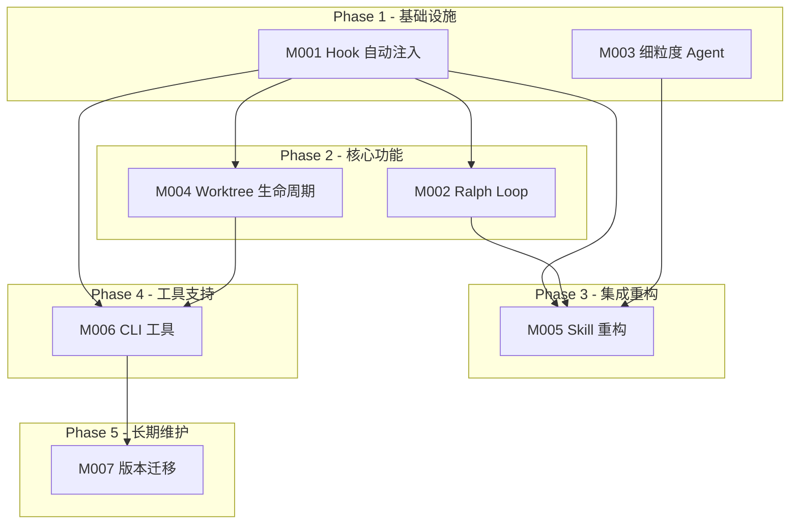

# P5-编码计划

> **For Claude:** REQUIRED SUB-SKILL: Use ideal-dev-exec to implement this plan task-by-task.

**Goal:** 将 Trellis 的工程化约束机制融入 CC-Workflow，实现 Hook 自动注入、Ralph Loop 质量控制、Worktree 生命周期管理、细粒度 Agent 定义和 Skill 全面重构。

**Architecture:** 采用分层架构（Hook 注入层 → Agent 能力层 → Worktree 隔离层），通过 Python Hook 脚本实现确定性执行，JSONL 配置驱动上下文注入，YAML 配置驱动 Worktree 管理。

**Tech Stack:** Python 3.10+ (Hook 脚本), TypeScript + Node.js (CLI 工具), Markdown (Agent 定义), YAML + JSONL (配置格式)

---

## 一、模块总览

| 模块编号 | 模块名称 | 功能描述 | 任务数 | 优先级 | 执行策略 | 依赖 |
|----------|----------|----------|--------|--------|----------|------|
| M001 | Hook 自动注入 | PreToolUse Hook 注入 jsonl 配置的上下文 | 6 | P0 | parallel | - |
| M002 | Ralph Loop 质量控制 | SubagentStop Hook 程序化验证 | 5 | P0 | sequential | M001 |
| M003 | 细粒度 Agent 定义 | implement/check/debug/research Agent | 4 | P0 | parallel | - |
| M004 | Worktree 生命周期 | P1 创建，P14 删除 | 5 | P0 | sequential | M001 |
| M005 | Skill 重构 | 所有 Skill 改用 Task 调用 | 10 | P0 | sequential | M001, M002, M003 |
| M006 | CLI 工具 | ideal init/update 命令 | 5 | P1 | sequential | M001, M004 |
| M007 | 版本迁移机制 | CLI 更新时处理文件变更 | 4 | P2 | sequential | M006 |

**总任务数：** 39 个

---

## 二、依赖关系

### 2.1 模块依赖图

### 2.2 执行顺序

| 批次 | 模块 | 执行策略 | 说明 |
|------|------|----------|------|
| Batch 1 | M001, M003 | parallel | 基础设施，无依赖，可并行 |
| Batch 2 | M002, M004 | parallel | 依赖 M001，可并行 |
| Batch 3 | M005 | sequential | 依赖 M001, M002, M003，顺序执行 |
| Batch 4 | M006 | sequential | 依赖 M001, M004 |
| Batch 5 | M007 | sequential | 依赖 M006 |

### 2.3 时间估算

| 模块 | 估算时间 | 说明 |
|------|----------|------|
| M001 | 2h | Hook 脚本实现 + 测试 |
| M002 | 1.5h | Ralph Loop 实现 + 测试 |
| M003 | 1h | 4 个 Agent 文件创建 |
| M004 | 1.5h | Worktree 脚本 + 集成 |
| M005 | 4h | 10 个 Skill 重构 |
| M006 | 2h | CLI 命令实现 |
| M007 | 1.5h | 迁移机制实现 |

**串行总时间：** 13.5h
**并行优化时间：** 7.5h（Batch 1: 2h, Batch 2: 1.5h, Batch 3: 4h）
**节省时间：** 6h

---

## 三、模块详细设计

### M001：Hook 自动注入

**目标：** 实现 PreToolUse Hook，在子 Agent 调用前自动注入 jsonl 配置的上下文。

**文件清单：**

| 文件 | 说明 |
|------|------|
| `.claude/hooks/inject-context.py` | Hook 脚本主文件 |
| `.claude/settings.json` | Hook 配置（新增） |
| `.ideal/.current-task` | 当前任务标记文件格式定义 |

**任务清单：**

#### T001-1：创建 inject-context.py 基础框架

- [ ] 编写 main() 函数框架
- [ ] 实现 stdin JSON 读取
- [ ] 实现工具名称检测（只拦截 Task）
- [ ] 编写单元测试验证拦截逻辑

**验证标准：**
- 测试：传入非 Task 工具调用，返回 sys.exit(0)
- 测试：传入 Task 工具调用，进入处理流程

#### T001-2：实现 subagent_type 检测

- [ ] 从 tool_input 提取 subagent_type
- [ ] 定义支持的 agent 类型列表
- [ ] 实现类型验证逻辑
- [ ] 编写测试用例

**验证标准：**
- 测试：传入 implement/check/debug/research，返回正确类型
- 测试：传入未知类型，返回默认处理

#### T001-3：实现 .current-task 读取

- [ ] 定义 .current-task 文件格式（单行路径）
- [ ] 实现 find_repo_root() 函数
- [ ] 实现 get_current_task() 函数
- [ ] 处理文件不存在的降级逻辑

**验证标准：**
- 测试：.current-task 存在时正确读取路径
- 测试：.current-task 不存在时返回 None

#### T001-4：实现 jsonl 配置读取

- [ ] 定义 ContextEntry 数据结构
- [ ] 实现 read_jsonl_entries() 函数
- [ ] 支持文件和目录类型
- [ ] 处理 JSONL 解析错误

**验证标准：**
- 测试：正确解析有效 JSONL 文件
- 测试：跳过无效行并记录警告

#### T001-5：实现上下文注入

- [ ] 实现 build_context() 函数（拼接文件内容）
- [ ] 实现 inject_to_prompt() 函数（插入到原始 prompt）
- [ ] 构建完整的输出 JSON
- [ ] 编写集成测试

**验证标准：**
- 测试：注入后的 prompt 包含所有配置文件内容
- 测试：输出 JSON 格式符合 Claude Code Hook 规范

#### T001-6：创建 settings.json 配置

- [ ] 定义 hooks 配置结构
- [ ] 配置 PreToolUse 触发器
- [ ] 指定 inject-context.py 路径
- [ ] 编写配置说明文档

**验证标准：**
- Claude Code 启动时无 Hook 配置错误
- 调用 Task 工具时 Hook 被触发

---

### M002：Ralph Loop 质量控制

**目标：** 实现 SubagentStop Hook，在 Check Agent 尝试停止时执行验证命令。

**文件清单：**

| 文件 | 说明 |
|------|------|
| `.claude/hooks/verify-loop.py` | Ralph Loop 脚本 |
| `.ideal/.verify-state.json` | 循环状态文件格式定义 |

**任务清单：**

#### T002-1：创建 verify-loop.py 基础框架

- [ ] 编写 main() 函数框架
- [ ] 实现 SubagentStop 事件检测
- [ ] 实现 check agent 类型过滤
- [ ] 编写基础测试

**验证标准：**
- 测试：非 check agent 调用时直接放行
- 测试：check agent 调用时进入验证流程

#### T002-2：实现 worktree.yaml 读取

- [ ] 实现 YAML 解析（不使用外部库，简单解析）
- [ ] 提取 verify 命令列表
- [ ] 处理配置不存在的情况
- [ ] 编写配置读取测试

**验证标准：**
- 测试：正确提取 verify 命令列表
- 测试：配置不存在时返回空列表

#### T002-3：实现验证命令执行

- [ ] 实现 run_verify_commands() 函数
- [ ] 支持 shell 命令执行
- [ ] 实现 120 秒超时
- [ ] 收集并返回错误信息

**验证标准：**
- 测试：全部命令通过返回 (True, "All passed")
- 测试：任一命令失败返回 (False, 错误信息)

#### T002-4：实现循环状态管理

- [ ] 定义 VerifyState 数据结构
- [ ] 实现 load_state() 和 save_state()
- [ ] 实现循环次数递增
- [ ] 实现 30 分钟超时检测

**验证标准：**
- 测试：状态文件正确保存和读取
- 测试：超过 5 次循环时允许停止

#### T002-5：实现决策输出

- [ ] 实现 allow/block 决策逻辑
- [ ] 生成详细的错误原因说明
- [ ] 编写集成测试

**验证标准：**
- 测试：验证通过时返回 allow
- 测试：验证失败且未达上限时返回 block
- 测试：达到上限时返回 allow + 警告

---

### M003：细粒度 Agent 定义

**目标：** 创建 implement、check、debug、research 四个新 Agent 文件。

**文件清单：**

| 文件 | 说明 |
|------|------|
| `.claude/agents/implement.md` | 实现工程师 Agent |
| `.claude/agents/check.md` | 代码检查 Agent |
| `.claude/agents/debug.md` | 调试工程师 Agent |
| `.claude/agents/research.md` | 研究员 Agent |

**任务清单：**

#### T003-1：创建 implement.md

- [ ] 定义角色身份和核心职责
- [ ] 定义禁止操作（git commit/push/merge）
- [ ] 定义输出规范（文件列表、摘要、待验证项）
- [ ] 添加使用场景说明

**验证标准：**
- 文件遵循现有 Agent 格式
- 包含完整的 YAML front matter

#### T003-2：创建 check.md

- [ ] 定义角色身份和核心职责
- [ ] 定义自我修复职责
- [ ] 定义检查清单输出格式
- [ ] 说明与 Ralph Loop 的配合

**验证标准：**
- 文件遵循现有 Agent 格式
- 包含与 verify-loop.py 的配合说明

#### T003-3：创建 debug.md

- [ ] 定义角色身份和核心职责
- [ ] 定义根因分析流程
- [ ] 定义调试报告格式
- [ ] 说明问题优先级分类（P1/P2/P3）

**验证标准：**
- 文件遵循现有 Agent 格式
- 包含调试方法论说明

#### T003-4：创建 research.md

- [ ] 定义角色身份和核心职责
- [ ] 定义禁止操作（任何文件修改）
- [ ] 定义研究输出格式
- [ ] 说明使用场景

**验证标准：**
- 文件遵循现有 Agent 格式
- 包含明确的不修改文件约束

---

### M004：Worktree 生命周期

**目标：** 实现 Worktree 创建和删除脚本，集成到 ideal-requirement Skill。

**文件清单：**

| 文件 | 说明 |
|------|------|
| `.ideal/worktree.yaml` | Worktree 配置文件 |
| `.claude/scripts/worktree-create.sh` | 创建 Worktree 脚本 |
| `.claude/scripts/worktree-remove.sh` | 删除 Worktree 脚本 |

**任务清单：**

#### T004-1：创建 worktree.yaml 配置

- [ ] 定义 worktree_dir 配置
- [ ] 定义 copy 文件列表
- [ ] 定义 post_create 命令列表
- [ ] 定义 verify 命令列表

**验证标准：**
- YAML 格式正确
- 配置项完整

#### T004-2：实现 worktree-create.sh

- [ ] 解析需求名称参数
- [ ] 读取 worktree.yaml 配置
- [ ] 执行 git worktree add
- [ ] 复制环境文件
- [ ] 执行初始化命令
- [ ] 写入 .current-task

**验证标准：**
- 测试：创建 Worktree 成功
- 测试：.current-task 正确写入

#### T004-3：实现 worktree-remove.sh

- [ ] 解析需求名称参数
- [ ] 确认代码已合并
- [ ] 执行 git worktree remove
- [ ] 可选删除分支

**验证标准：**
- 测试：Worktree 正确删除
- 测试：代码未合并时提示用户

#### T004-4：更新 dev.md Agent

- [ ] 添加 Worktree 调度职责
- [ ] 说明 implement/check/debug 调用顺序
- [ ] 更新使用场景说明

**验证标准：**
- dev.md 包含新的调度职责
- 与现有内容兼容

#### T004-5：集成到 ideal-requirement

- [ ] 在 P1 阶段调用 worktree-create.sh
- [ ] 更新 Skill 文档说明
- [ ] 编写集成测试

**验证标准：**
- P1 需求创建时自动创建 Worktree
- .current-task 正确指向需求目录

---

### M005：Skill 重构

**目标：** 将所有 Skill 从注释扮演改为 Task 工具调用。

**文件清单：**

| 文件 | 说明 |
|------|------|
| `.claude/skills/ideal-requirement/SKILL.md` | 重构 |
| `.claude/skills/ideal-dev-solution/SKILL.md` | 重构 |
| `.claude/skills/ideal-dev-plan/SKILL.md` | 重构 |
| `.claude/skills/ideal-dev-exec/SKILL.md` | 重构（含 Ralph Loop） |
| `.claude/skills/ideal-code-review/SKILL.md` | 重构 |
| `.claude/skills/ideal-test-case/SKILL.md` | 重构 |
| `.claude/skills/ideal-test-exec/SKILL.md` | 重构 |
| `.claude/skills/ideal-wiki/SKILL.md` | 重构 |
| `.claude/skills/ideal-debugging/SKILL.md` | 重构 |

**任务清单：**

#### T005-1：重构 ideal-dev-exec（核心）

- [ ] 去掉所有 `<!-- AGENT: dev -->` 注释
- [ ] 添加 Task 调用 implement Agent
- [ ] 添加 Task 调用 check Agent
- [ ] 添加 Task 调用 debug Agent（失败时）
- [ ] 更新 Workflow 说明

**验证标准：**
- 无注释扮演方式
- 包含完整的 Task 调用示例
- 说明 Hook 自动注入机制

#### T005-2：重构 ideal-code-review

- [ ] 去掉 `<!-- AGENT: dev/architect -->` 注释
- [ ] 添加 Task 调用 check Agent
- [ ] 更新两阶段审查说明

**验证标准：**
- 使用 Task 调用 check Agent
- 说明与 Ralph Loop 的配合

#### T005-3：重构 ideal-requirement

- [ ] 去掉 `<!-- AGENT: pm/analyst -->` 注释
- [ ] 添加 Task 调用 pm Agent
- [ ] 添加 Task 调用 analyst Agent（竞品分析时）
- [ ] 添加 Worktree 创建调用

**验证标准：**
- 使用 Task 调用 pm/analyst Agent
- P1 阶段创建 Worktree

#### T005-4：重构 ideal-dev-solution

- [ ] 去掉 `<!-- AGENT: architect -->` 注释
- [ ] 添加 Task 调用 architect Agent
- [ ] 更新技术选型流程

**验证标准：**
- 使用 Task 调用 architect Agent
- 上下文自动注入

#### T005-5：重构 ideal-dev-plan

- [ ] 去掉 `<!-- AGENT: architect/pm -->` 注释
- [ ] 添加 Task 调用 architect Agent
- [ ] 添加 Task 调用 pm Agent（优先级评估时）
- [ ] 更新故事文件生成说明

**验证标准：**
- 使用 Task 调用 architect/pm Agent
- 包含 jsonl 配置生成说明

#### T005-6：重构 ideal-test-case

- [ ] 去掉 `<!-- AGENT: qa -->` 注释
- [ ] 添加 Task 调用 qa Agent
- [ ] 更新测试用例生成流程

**验证标准：**
- 使用 Task 调用 qa Agent
- 上下文自动注入

#### T005-7：重构 ideal-test-exec

- [ ] 去掉 `<!-- AGENT: qa/dev -->` 注释
- [ ] 添加 Task 调用 qa Agent
- [ ] 添加 Task 调用 debug Agent（失败时）
- [ ] 更新测试执行流程

**验证标准：**
- 使用 Task 调用 qa/debug Agent
- 说明失败时的调试流程

#### T005-8：重构 ideal-wiki

- [ ] 去掉 `<!-- AGENT: tech-writer -->` 注释
- [ ] 添加 Task 调用 tech-writer Agent
- [ ] 更新维基生成流程

**验证标准：**
- 使用 Task 调用 tech-writer Agent
- 上下文自动注入

#### T005-9：重构 ideal-debugging

- [ ] 去掉 `<!-- AGENT: dev -->` 注释
- [ ] 添加 Task 调用 debug Agent
- [ ] 更新调试流程说明

**验证标准：**
- 使用 Task 调用 debug Agent
- 包含根因分析流程

#### T005-10：更新 agents/README.md

- [ ] 添加新 Agent 清单
- [ ] 更新调用方式说明
- [ ] 添加 Task 工具调用示例

**验证标准：**
- 包含 10 个 Agent 的完整说明
- 包含 Task 调用示例

---

### M006：CLI 工具

**目标：** 实现 ideal init、ideal update、ideal worktree 命令。

**文件清单：**

| 文件 | 说明 |
|------|------|
| `package.json` | npm 包配置 |
| `src/cli/index.ts` | CLI 入口 |
| `src/cli/commands/init.ts` | init 命令实现 |
| `src/cli/commands/update.ts` | update 命令实现 |
| `src/cli/commands/worktree.ts` | worktree 命令实现 |

**任务清单：**

#### T006-1：初始化 CLI 项目

- [ ] 创建 package.json
- [ ] 配置 TypeScript
- [ ] 配置构建脚本
- [ ] 创建 src/cli/index.ts 入口

**验证标准：**
- npm install 成功
- npm run build 成功
- ideal --help 输出帮助信息

#### T006-2：实现 ideal init

- [ ] 解析命令行参数（-y, -u）
- [ ] 创建 .ideal/ 目录
- [ ] 创建 .claude/hooks/ 目录
- [ ] 复制 Hook 脚本模板
- [ ] 创建 worktree.yaml 模板
- [ ] 创建 settings.json 配置

**验证标准：**
- ideal init 创建完整的目录结构
- 所有文件正确生成

#### T006-3：实现 ideal update

- [ ] 解析命令行参数（--dry-run, -f）
- [ ] 读取当前版本号
- [ ] 比较模板文件哈希
- [ ] 处理文件更新（跳过/覆盖/备份）
- [ ] 更新版本号

**验证标准：**
- ideal update --dry-run 显示变更预览
- ideal update 正确更新文件

#### T006-4：实现 ideal worktree list

- [ ] 执行 git worktree list
- [ ] 格式化输出表格
- [ ] 显示 Worktree 状态

**验证标准：**
- 正确列出所有 Worktree
- 输出格式清晰

#### T006-5：实现 ideal worktree create/remove

- [ ] create: 调用 worktree-create.sh
- [ ] remove: 调用 worktree-remove.sh
- [ ] 错误处理和提示

**验证标准：**
- ideal worktree create 正确创建
- ideal worktree remove 正确删除

---

### M007：版本迁移机制

**目标：** 实现 CLI 更新时的文件迁移和冲突处理。

**文件清单：**

| 文件 | 说明 |
|------|------|
| `src/cli/migrations/index.ts` | 迁移入口 |
| `src/cli/migrations/manifests/*.json` | 迁移清单 |

**任务清单：**

#### T007-1：定义迁移清单格式

- [ ] 定义文件重命名清单
- [ ] 定义文件删除清单
- [ ] 定义版本号格式
- [ ] 编写格式文档

**验证标准：**
- JSON Schema 正确
- 示例清单可解析

#### T007-2：实现迁移检测

- [ ] 读取当前版本
- [ ] 读取目标版本
- [ ] 加载中间版本的迁移清单
- [ ] 生成迁移计划

**验证标准：**
- 正确检测需要迁移的版本
- 生成完整的迁移计划

#### T007-3：实现文件迁移执行

- [ ] 处理文件重命名
- [ ] 处理文件删除
- [ ] 检测用户修改（哈希对比）
- [ ] 提示冲突处理选项

**验证标准：**
- 迁移后文件结构正确
- 用户修改被保留

#### T007-4：集成到 ideal update

- [ ] 在 update 命令中调用迁移模块
- [ ] 提供 --migrate 参数
- [ ] 生成迁移报告

**验证标准：**
- ideal update --migrate 正确执行迁移
- 迁移报告清晰

---

## 四、验证计划

### 4.1 模块验证

| 模块 | 验证命令 | 预期结果 |
|------|----------|----------|
| M001 | Claude Code 调用 Task 工具 | Hook 注入上下文 |
| M002 | Check Agent 尝试停止 | 验证命令执行 |
| M003 | Task(subagent_type="implement") | 正确的 Agent 被调用 |
| M004 | ideal init | Worktree 创建成功 |
| M005 | 执行完整 P1-P9 流程 | 所有 Skill 正常工作 |
| M006 | ideal --help | 显示帮助信息 |
| M007 | ideal update --migrate | 迁移成功 |

### 4.2 集成验证

1. **P1-P9 完整流程**
   - 创建需求 → Worktree 自动创建
   - 技术方案 → Hook 注入上下文
   - 开发执行 → Task 调用子 Agent
   - Check 阶段 → Ralph Loop 验证

2. **多需求并行**
   - 创建需求 A → Worktree A
   - 创建需求 B → Worktree B
   - 并行开发无冲突

---

## 五、执行选项

计划完成后提供两个选项：

| 选项 | 说明 | 适用场景 |
|------|------|----------|
| **Subagent-Driven** | 当前会话，每任务派遣子代理，任务间两阶段审查 | 小规模任务，需要实时监控 |
| **Parallel Session** | 独立会话，使用 ideal-dev-exec 批量执行 | 大规模任务，自动化执行 |

---

*文档版本: v1.0*
*创建时间: 2026-02-22*
*作者: Claude Code*
