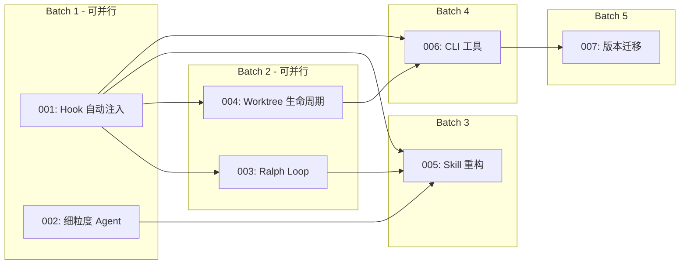

# 故事索引

## 概览

| 故事 | 标题 | 状态 | 依赖 | 任务数 | 预估时间 |
|------|------|------|------|--------|----------|
| [001](001-Hook自动注入.md) | Hook 自动注入（M001） | ⏳ 待开始 | - | 6 | 2h |
| [002](002-细粒度Agent定义.md) | 细粒度 Agent 定义（M003） | ⏳ 待开始 | - | 4 | 1h |
| [003](003-RalphLoop质量控制.md) | Ralph Loop 质量控制（M002） | ⏳ 待开始 | 001 | 5 | 1.5h |
| [004](004-Worktree生命周期.md) | Worktree 生命周期（M004） | ⏳ 待开始 | 001 | 5 | 1.5h |
| [005](005-Skill重构.md) | Skill 重构（M005） | ⏳ 待开始 | 001, 002, 003 | 10 | 4h |
| [006](006-CLI工具.md) | CLI 工具（M006） | ⏳ 待开始 | 001, 004 | 5 | 2h |
| [007](007-版本迁移机制.md) | 版本迁移机制（M007） | ⏳ 待开始 | 006 | 4 | 1.5h |

**总计**：7 个故事，39 个任务，预估 13.5h（串行）或 7.5h（并行优化）

## 依赖关系

## 执行顺序

### Batch 1（可并行执行）
1. **001-Hook自动注入** - 基础设施，无依赖
2. **002-细粒度Agent定义** - Agent 定义，无依赖

### Batch 2（可并行执行，依赖 Batch 1）
1. **003-RalphLoop质量控制** - 依赖 001
2. **004-Worktree生命周期** - 依赖 001

### Batch 3（顺序执行，依赖 Batch 1 + Batch 2）
1. **005-Skill重构** - 依赖 001, 002, 003

### Batch 4（顺序执行，依赖 Batch 1 + Batch 2）
1. **006-CLI工具** - 依赖 001, 004

### Batch 5（顺序执行，依赖 Batch 4）
1. **007-版本迁移机制** - 依赖 006

## 执行策略

### 选项 A：Subagent-Driven（当前会话）
- 每个故事派遣子 Agent 执行
- 故事间进行两阶段审查
- 适合：小规模任务，需要实时监控

### 选项 B：Parallel Session（独立会话）
- 使用 ideal-dev-exec 批量执行
- 按 Batch 分批执行
- 适合：大规模任务，自动化执行

## 状态说明

| 状态 | 说明 |
|------|------|
| ⏳ 待开始 | 故事未开始执行 |
| 🔄 进行中 | 故事正在执行 |
| ✅ 已完成 | 故事已完成 |
| ❌ 已阻塞 | 故事被阻塞，需要解决依赖问题 |

## 完成记录

<!-- 执行过程中更新 -->

| 故事 | 完成时间 | 执行者 | 备注 |
|------|----------|--------|------|
| - | - | - | - |
