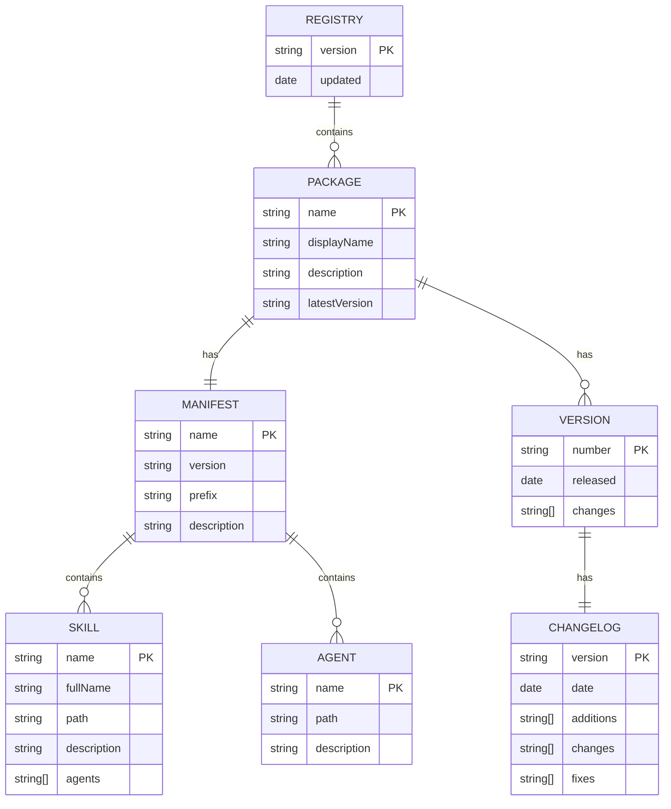

# P3-技术方案：ideal-best-practice 发布体系构建

## 一、方案概述

### 1.1 设计目标

构建企业级 Claude Code 最佳实践发布平台，实现以下技术目标：

1. **标准化包管理**：定义 manifest.json 和 registry.json 规范，支持语义化版本
2. **跨平台安装**：提供 Shell 和 PowerShell 脚本，覆盖 macOS、Linux、Windows
3. **文档站建设**：基于 Docusaurus 构建产品 Wiki 站点
4. **产品主页展示**：简洁的产品介绍页面
5. **自动化发布**：通用的 CI/CD 发布流程，可复用于其他项目

### 1.2 核心设计原则

| 原则 | 说明 |
|------|------|
| 简单优先 | 使用成熟技术，避免过度设计 |
| 单一数据源 | registry.json 作为唯一包索引源 |
| 通用可复用 | 发布相关 Skills 可被其他项目复用 |
| 职责分离 | 产品资源发布与 Wiki 发布解耦 |

### 1.3 技术栈选型

| 层级 | 技术选型 | 选型理由 |
|------|----------|----------|
| 包元数据 | JSON (manifest.json, registry.json) | Claude Code 原生支持，无需额外解析器 |
| 安装脚本 | Bash + PowerShell | 原生跨平台支持，无运行时依赖 |
| 产品主页 | HTML5 + CSS3 + Vanilla JS | 零构建依赖，直接托管于 GitHub Pages |
| Wiki 文档站 | Docusaurus | 企业级静态文档站方案，功能完善 |
| 托管平台 | GitHub + GitHub Pages | 企业标准代码托管，内置静态站点能力 |

---

## 二、发布流程阶段定义

### 2.1 完整发布流程（P14-P17）

基于本次需求，扩展原有 16 阶段流程至 17 阶段：

| 阶段 | 名称 | 调用 Skill | 职责 |
|------|------|------------|------|
| P14 | 产品发布 | `ideal-product-release` | CI/CD：版本管理、构建、测试、部署、发布记录 |
| P15 | Wiki 编写 | - | Wiki 文档编写/更新（技术写作） |
| P16 | Wiki 评审 | - | Wiki 内容评审 |
| P17 | Wiki 发布 | `ideal-wiki-release` | Wiki 站构建、产品主页更新、站点部署 |

### 2.2 发布流程图

```
┌─────────────────────────────────────────────────────────────────────────────┐
│                           发布流程 (P14-P17)                                  │
└─────────────────────────────────────────────────────────────────────────────┘

     P13 上线评审
          │
          ▼
┌─────────────────┐
│  P14 产品发布   │  ideal-product-release
│                 │  ┌─────────────────────────────────────────────┐
│                 │  │ 1. 版本号管理（语义化版本自动递增）          │
│                 │  │ 2. 元数据生成（manifest/registry）          │
│                 │  │ 3. 构建验证（完整性检查、测试）              │
│                 │  │ 4. 部署执行（文件同步、git push）           │
│                 │  │ 5. 发布记录（changelog、tag）               │
│                 │  └─────────────────────────────────────────────┘
└────────┬────────┘
         │
         ▼
┌─────────────────┐
│  P15 Wiki 编写  │  技术写作
│                 │  ┌─────────────────────────────────────────────┐
│                 │  │ - 用户文档                                   │
│                 │  │ - API 文档                                   │
│                 │  │ - 快速开始指南                               │
│                 │  │ - 更新日志                                   │
│                 │  └─────────────────────────────────────────────┘
└────────┬────────┘
         │
         ▼
┌─────────────────┐
│  P16 Wiki 评审  │  内容评审
│                 │  ┌─────────────────────────────────────────────┐
│                 │  │ - 准确性检查                                 │
│                 │  │ - 完整性检查                                 │
│                 │  │ - 格式规范检查                               │
│                 │  └─────────────────────────────────────────────┘
└────────┬────────┘
         │
         ▼
┌─────────────────┐
│  P17 Wiki 发布  │  ideal-wiki-release
│                 │  ┌─────────────────────────────────────────────┐
│                 │  │ 1. 构建文档站（Docusaurus build）           │
│                 │  │ 2. 更新产品主页                             │
│                 │  │ 3. 部署到 GitHub Pages                      │
│                 │  │ 4. 发布验证                                 │
│                 │  └─────────────────────────────────────────────┘
└─────────────────┘
```

---

## 三、通用 Skills 设计

### 3.0 Skill 创建方式

本需求需要新增两个通用 Skills，创建方式如下：

| Skill | 创建方式 | 说明 |
|-------|----------|------|
| ideal-product-release | 调用 `writing-skills` | 基于 Skill 规范创建发布流程 Skill |
| ideal-wiki-release | 调用 `writing-skills` | 基于 Skill 规范创建 Wiki 发布 Skill |

**创建流程：**

```
P5 计划生成
     │
     ├── 任务 1: 调用 /writing-skills 创建 ideal-product-release
     │           │
     │           ├── 收集 Skill 需求（职责、工作流、配置项）
     │           ├── 生成 SKILL.md
     │           ├── 生成 scripts/ 脚本
     │           └── 生成 references/ 模板和指南
     │
     └── 任务 2: 调用 /writing-skills 创建 ideal-wiki-release
                 │
                 ├── 收集 Skill 需求（职责、工作流、配置项）
                 ├── 生成 SKILL.md
                 ├── 生成 scripts/ 脚本
                 └── 生成 references/ 模板和指南
```

**writing-skills 调用示例：**

```bash
# 创建 ideal-product-release Skill
/writing-skills

# 交互过程
Claude: 请描述要创建的 Skill 的用途
User:   创建一个通用的产品发布 Skill，负责 CI/CD 流程，包括版本管理、
        构建验证、部署执行、发布记录和回滚机制

Claude: 请描述 Skill 的工作流程
User:   1. 分析 commits 确定版本递增类型
        2. 生成 manifest.json 和更新 registry.json
        3. 执行完整性检查和测试
        4. 同步文件到发布仓库并创建 tag
        5. 生成 changelog

# ... 继续交互直到 Skill 创建完成
```

### 3.1 ideal-product-release（产品发布 Skill）

**定位：** 通用的 CI/CD 发布流程 Skill，可被任何需要发布产品资源的项目复用。

**调用阶段：** P14

**Skill 职责：**

| 职责 | 说明 |
|------|------|
| 版本管理 | 语义化版本自动递增（major/minor/patch） |
| 元数据生成 | 生成/更新 manifest.json、registry.json |
| 构建验证 | 完整性检查、单元测试、集成测试 |
| 部署执行 | 文件同步、git push、创建 tag |
| 发布记录 | 自动生成 changelog、更新版本历史 |
| 多环境支持 | staging/production 环境切换 |
| 回滚机制 | 发布失败时自动回滚 |

**Skill 定义结构：**

```
ideal-product-release/
├── SKILL.md
├── scripts/
│   ├── version-bump.sh          # 版本号递增
│   ├── generate-manifest.py     # 生成 manifest.json
│   ├── update-registry.py       # 更新 registry.json
│   ├── validate-package.py      # 完整性校验
│   ├── deploy.sh                # 部署执行
│   ├── rollback.sh              # 回滚脚本
│   └── generate-changelog.py    # 生成 changelog
└── references/
    ├── templates/
    │   ├── manifest.template.json
    │   └── changelog.template.md
    └── guides/
        ├── version-strategy.md
        └── rollback-guide.md
```

**SKILL.md 核心内容：**

```markdown
# ideal-product-release

## Overview
通用的 CI/CD 发布流程 Skill，负责产品资源的版本管理、构建验证和部署发布。

## Workflow
1. 版本管理：根据 commit 类型自动确定版本递增类型
2. 元数据生成：扫描项目文件生成 manifest/registry
3. 构建验证：执行测试套件，校验文件完整性
4. 部署执行：同步文件到发布仓库，创建 git tag
5. 发布记录：生成 changelog，更新版本历史

## Agents
| Agent | 角色 | 用途 |
|-------|------|------|
| dev | 开发工程师 | 执行发布操作 |
| architect | 架构师 | 发布策略审核（可选） |

## 配置项
- version.strategy: semver | custom
- deploy.environments: staging, production
- rollback.auto: true | false
- changelog.format: conventional | simple
```

### 3.2 ideal-wiki-release（Wiki 发布 Skill）

**定位：** 通用的 Wiki 文档发布 Skill，负责文档站构建和部署，可被任何项目复用。

**调用阶段：** P17

**Skill 职责：**

| 职责 | 说明 |
|------|------|
| 文档站构建 | Docusaurus 构建静态文件 |
| 产品主页更新 | 更新介绍页面内容 |
| 站点部署 | 部署到 GitHub Pages |
| 版本化文档 | 支持多版本文档（可选） |
| SEO 优化 | 自动生成 sitemap、meta 信息 |
| 发布验证 | 检查链接有效性、资源完整性 |

**Skill 定义结构：**

```
ideal-wiki-release/
├── SKILL.md
├── scripts/
│   ├── build-docs.sh            # Docusaurus 构建
│   ├── update-homepage.py       # 更新产品主页
│   ├── deploy-pages.sh          # 部署到 GitHub Pages
│   ├── validate-links.py        # 链接有效性检查
│   └── generate-sitemap.py      # 生成 sitemap
└── references/
    ├── templates/
    │   ├── docusaurus.config.template.js
    │   └── homepage.template.md
    └── guides/
        ├── docusaurus-setup.md
        └── multi-version-docs.md
```

**SKILL.md 核心内容：**

```markdown
# ideal-wiki-release

## Overview
通用的 Wiki 文档发布 Skill，负责文档站构建、产品主页更新和部署。

## Workflow
1. 预检查：验证文档目录结构、资源文件完整性
2. 构建文档站：执行 Docusaurus build
3. 更新产品主页：从配置同步主页内容
4. 部署执行：推送到 GitHub Pages 分支
5. 发布验证：检查链接有效性、页面可访问性

## Agents
| Agent | 角色 | 用途 |
|-------|------|------|
| tech-writer | 技术文档撰写 | 文档内容确认 |
| dev | 开发工程师 | 执行部署操作 |

## 配置项
- docs.framework: docusaurus | vitepress | docsify
- deploy.branch: gh-pages | docs
- homepage.update: true | false
- versioning.enabled: true | false
```

---

## 四、系统架构

### 4.1 整体架构图

```
┌─────────────────────────────────────────────────────────────────────────────┐
│                           开发仓库 (cc-workflow)                              │
│  ┌─────────────┐  ┌─────────────┐  ┌─────────────┐  ┌─────────────┐        │
│  │ .claude/    │  │   docs/     │  │  scripts/   │  │ Wiki/       │        │
│  │ ├─agents/   │  │  └─迭代/    │  │             │  │ (文档源文件) │        │
│  │ └─skills/   │  │             │  │             │  │             │        │
│  └──────┬──────┘  └─────────────┘  └──────┬──────┘  └──────┬──────┘        │
│         │                                  │                │               │
│         └──────────────┬───────────────────┘                │               │
│                        │ P14: ideal-product-release         │               │
│                        ▼                                    │               │
└─────────────────────────────────────────────────────────────┼───────────────┘
                         │                                    │
                         │                                    │
                         ▼                                    │
┌─────────────────────────────────────────────────────────────────────────────┐
│                      发布仓库 (ideal-best-practice)                           │
│                                                                              │
│  ┌────────────────────────────────────────────────────────────────────┐     │
│  │                      packages/ (产品资源)                            │     │
│  │  ┌─────────────────┐  ┌─────────────┐  ┌─────────────┐             │     │
│  │  │ registry.json   │  │ manifest.json│  │ skills/     │             │     │
│  │  │ (包索引)        │  │ (包元数据)   │  │ agents/     │             │     │
│  │  └─────────────────┘  └─────────────┘  └─────────────┘             │     │
│  └────────────────────────────────────────────────────────────────────┘     │
│                                                                              │
│  ┌────────────────────────────────────────────────────────────────────┐     │
│  │                      install/ (安装脚本)                             │     │
│  │  ┌─────────────────┐  ┌─────────────┐                               │     │
│  │  │ install.sh      │  │ install.ps1 │                               │     │
│  │  │ (macOS/Linux)   │  │ (Windows)   │                               │     │
│  │  └─────────────────┘  └─────────────┘                               │     │
│  └────────────────────────────────────────────────────────────────────┘     │
│                                                                              │
│  ┌────────────────────────────────────────────────────────────────────┐     │
│  │                      wiki/ (文档站源文件) ◄─────────────────────────┼─────┤
│  │  ┌─────────────────────────────────────────────────────────────┐   │     │
│  │  │ docusaurus.config.js                                        │   │     │
│  │  ├── docs/                                                    │   │     │
│  │  │   ├── intro.md                                             │   │     │
│  │  │   ├── getting-started/                                     │   │     │
│  │  │   └── api/                                                 │   │     │
│  │  ├── blog/                                                   │   │     │
│  │  └── src/                                                    │   │     │
│  │      └── pages/                                              │   │     │
│  │          └── index.js  (产品主页)                             │   │     │
│  │  └─────────────────────────────────────────────────────────────┘   │     │
│  └────────────────────────────────────────────────────────────────────┘     │
│                                                                              │
│  ┌────────────────────────────────────────────────────────────────────┐     │
│  │                      P17: ideal-wiki-release                        │     │
│  │                              │                                      │     │
│  │                              ▼                                      │     │
│  │  ┌─────────────────────────────────────────────────────────────┐   │     │
│  │  │                   GitHub Pages (部署目标)                    │   │     │
│  │  │  ┌───────────────────┐  ┌───────────────────────────────┐  │   │     │
│  │  │  │ 产品主页          │  │ 文档站                        │  │   │     │
│  │  │  │ (Landing Page)    │  │ /docs/intro                   │  │   │     │
│  │  │  │                   │  │ /docs/getting-started         │  │   │     │
│  │  │  └───────────────────┘  └───────────────────────────────┘  │   │     │
│  │  └─────────────────────────────────────────────────────────────┘   │     │
│  └────────────────────────────────────────────────────────────────────┘     │
│                                                                              │
└─────────────────────────────────────────────────────────────────────────────┘
```

### 4.2 目录结构设计

**发布仓库 (ideal-best-practice)：**

```
ideal-best-practice/
├── registry.json                    # 包注册表（唯一索引源）
│
├── packages/                        # 所有可安装包
│   └── ideal-dev/                   # 产品线：开发工作流
│       ├── manifest.json            # 包元数据
│       ├── skills/                  # Skill 定义
│       │   ├── ideal-requirement/
│       │   ├── ideal-dev-solution/
│       │   ├── ideal-dev-plan/
│       │   ├── ideal-test-case/
│       │   ├── ideal-dev-exec/
│       │   ├── ideal-code-review/
│       │   ├── ideal-test-exec/
│       │   ├── ideal-wiki/
│       │   ├── ideal-flow-control/
│       │   ├── ideal-debugging/
│       │   ├── ideal-product-release/   # 新增：产品发布 Skill
│       │   └── ideal-wiki-release/      # 新增：Wiki 发布 Skill
│       └── agents/                  # Agent 定义
│           ├── analyst.md
│           ├── pm.md
│           ├── architect.md
│           ├── dev.md
│           ├── qa.md
│           └── tech-writer.md
│
├── install/                         # 安装脚本
│   ├── install.sh                   # Unix 安装脚本
│   └── install.ps1                  # Windows 安装脚本
│
└── wiki/                            # Docusaurus 文档站
    ├── docusaurus.config.js         # Docusaurus 配置
    ├── package.json
    ├── sidebars.js
    ├── docs/                        # 文档内容
    │   ├── intro.md
    │   ├── getting-started/
    │   │   ├── installation.md
    │   │   ├── quick-start.md
    │   │   └── configuration.md
    │   ├── user-guide/
    │   │   ├── workflow.md
    │   │   ├── skills.md
    │   │   └── agents.md
    │   ├── advanced/
    │   │   ├── custom-skills.md
    │   │   └── best-practices.md
    │   └── api/
    │       └── reference.md
    ├── blog/                        # 更新日志（可选）
    │   └── releases/
    └── src/
        └── pages/
            └── index.js             # 产品主页（Landing Page）
```

**开发仓库新增 (cc-workflow)：**

```
cc-workflow/
├── .claude/
│   └── skills/
│       ├── ideal-product-release/   # 新增：产品发布 Skill
│       └── ideal-wiki-release/      # 新增：Wiki 发布 Skill
├── docs/
│   └── Wiki/                        # Wiki 文档源文件（开发阶段）
└── scripts/
    └── publish.sh                   # 发布脚本（已存在）
```

---

## 五、功能模块设计

### 5.1 模块总览

| 模块编号 | 模块名称 | 功能描述 | 对应 Skill |
|----------|----------|----------|------------|
| M001 | 包管理模块 | 定义包结构、元数据规范、版本索引 | - |
| M002 | 安装模块 | 跨平台安装脚本、版本选择、错误处理 | - |
| M003 | 产品发布模块 | CI/CD 发布流程、版本管理、回滚 | ideal-product-release |
| M004 | Wiki 文档站模块 | Docusaurus 构建、多版本文档 | - |
| M005 | Wiki 发布模块 | 文档站构建、主页更新、部署 | ideal-wiki-release |

### 5.2 模块详细设计

#### M001 包管理模块

**职责：** 定义包的标准结构和元数据规范

**核心组件：**

| 组件 | 文件 | 职责 |
|------|------|------|
| 包注册表 | registry.json | 索引所有可用包，提供版本列表 |
| 包元数据 | manifest.json | 定义单个包的详细信息 |
| 包内容 | packages/{name}/ | Skills 和 Agents 定义文件 |

#### M002 安装模块

**职责：** 提供跨平台的一键安装能力

**安装流程：**

```
┌─────────────┐     ┌─────────────┐     ┌─────────────┐
│ 参数解析    │────►│ 环境检测    │────►│ 获取包信息  │
│ (包名/版本) │     │ (curl/网络) │     │(fetch reg)  │
└─────────────┘     └─────────────┘     └──────┬──────┘
                                               │
                                               ▼
┌─────────────┐     ┌─────────────┐     ┌─────────────┐
│ 显示完成    │◄────│ 注册到      │◄────│ 复制文件    │
│ 信息        │     │ Claude Code │     │ 到目标目录  │
└─────────────┘     └─────────────┘     └─────────────┘
```

#### M003 产品发布模块（ideal-product-release）

**完整 CI/CD 流程：**

```
┌─────────────────────────────────────────────────────────────────────────────┐
│                        ideal-product-release Workflow                        │
└─────────────────────────────────────────────────────────────────────────────┘

┌──────────────┐    ┌──────────────┐    ┌──────────────┐    ┌──────────────┐
│ 1. 版本管理  │───►│ 2. 元数据生成│───►│ 3. 构建验证  │───►│ 4. 部署执行  │
│              │    │              │    │              │    │              │
│ - 分析 commits│   │ - manifest   │    │ - 完整性检查 │    │ - 文件同步   │
│ - 确定版本类型│   │ - registry   │    │ - 测试执行   │    │ - git push   │
│ - 递增版本号 │    │ - 校验格式   │    │ - 依赖检查   │    │ - 创建 tag   │
└──────────────┘    └──────────────┘    └──────────────┘    └──────┬───────┘
                                                                   │
                                   ┌───────────────────────────────┘
                                   │
                                   ▼
                         ┌──────────────┐    ┌──────────────┐
                         │ 5. 发布记录  │───►│ 6. 通知      │
                         │              │    │              │
                         │ - changelog  │    │ - 成功通知   │
                         │ - 版本历史   │    │ - 失败告警   │
                         └──────────────┘    └──────────────┘
```

**版本管理策略：**

| Commit 类型 | 版本递增 | 示例 |
|-------------|----------|------|
| feat: | minor | 1.0.0 → 1.1.0 |
| fix: | patch | 1.0.0 → 1.0.1 |
| feat!:/BREAKING CHANGE | major | 1.0.0 → 2.0.0 |
| docs:/chore:/style: | 无递增 | 保持当前版本 |

**回滚机制：**

```bash
# 发布失败时自动回滚
if deploy_failed; then
  git tag -d "v$VERSION"
  git push --delete origin "v$VERSION"
  git reset --hard HEAD~1
  echo "Rollback completed"
fi
```

#### M004 Wiki 文档站模块

**Docusaurus 配置要点：**

```javascript
// docusaurus.config.js
module.exports = {
  title: 'Ideal Best Practice',
  tagline: 'Claude Code 最佳实践，一键安装',
  url: 'https://ideal.github.io',
  baseUrl: '/ideal-best-practice/',
  organizationName: 'ideal',
  projectName: 'ideal-best-practice',

  presets: [
    [
      '@docusaurus/preset-classic',
      {
        docs: {
          sidebarPath: require.resolve('./sidebars.js'),
          editUrl: 'https://github.com/ideal/ideal-best-practice/tree/main/wiki/',
        },
        blog: {
          path: 'blog/releases',
          blogTitle: 'Release Notes',
        },
      },
    ],
  ],
};
```

#### M005 Wiki 发布模块（ideal-wiki-release）

**发布流程：**

```
┌─────────────────────────────────────────────────────────────────────────────┐
│                         ideal-wiki-release Workflow                          │
└─────────────────────────────────────────────────────────────────────────────┘

┌──────────────┐    ┌──────────────┐    ┌──────────────┐    ┌──────────────┐
│ 1. 预检查    │───►│ 2. 构建文档站│───►│ 3. 更新主页  │───►│ 4. 部署执行  │
│              │    │              │    │              │    │              │
│ - 文档完整性 │    │ - npm install│    │ - 版本信息   │    │ - gh-pages   │
│ - 资源文件   │    │ - npm run    │    │ - 更新日志   │    │ - DNS 配置   │
│ - 链接有效性 │    │   build      │    │ - 特性列表   │    │ - CDN 刷新   │
└──────────────┘    └──────────────┘    └──────────────┘    └──────┬───────┘
                                                                   │
                                   ┌───────────────────────────────┘
                                   ▼
                         ┌──────────────┐
                         │ 5. 发布验证  │
                         │              │
                         │ - 页面可访问 │
                         │ - 链接正常   │
                         │ - 资源加载   │
                         └──────────────┘
```

---

## 六、数据模型

### 6.1 核心数据模型

**实体关系图：**



---

## 七、接口设计

### 7.1 安装脚本接口

**install.sh / install.ps1：**

```bash
# 用法
./install.sh [package[@version]] [options]

# 选项
-h, --help         显示帮助信息
-l, --list         列出所有可用包
-v, --verbose      显示详细输出
--dry-run          模拟安装
--mirror <url>     使用镜像地址
```

### 7.2 ideal-product-release 接口

```bash
# 用法
/ideal-product-release [options]

# 选项
--version <type>   版本递增类型：major | minor | patch | auto
--env <name>       部署环境：staging | production
--dry-run          模拟发布
--skip-tests       跳过测试
--rollback         回滚到上一版本
```

### 7.3 ideal-wiki-release 接口

```bash
# 用法
/ideal-wiki-release [options]

# 选项
--skip-homepage    跳过主页更新
--skip-validation  跳过链接验证
--dry-run          模拟部署
```

---

## 八、风险分析与应对

### 8.1 主要风险

| 风险项 | 影响程度 | 发生概率 | 应对措施 |
|--------|----------|----------|----------|
| GitHub 国内访问受限 | 高 | 中 | 提供镜像下载；支持离线安装包 |
| Windows 执行策略限制 | 中 | 中 | 文档说明设置方法；提供绕过命令 |
| Docusaurus 构建失败 | 中 | 低 | 本地预校验；构建日志记录 |
| 发布回滚失败 | 高 | 低 | 保留历史 tag；手动回滚文档 |
| Wiki 内容与产品版本不同步 | 中 | 中 | 版本锁定机制；文档版本标注 |

### 8.2 风险应对策略

**R1: GitHub 国内访问受限**
- 提供离线安装包（.tar.gz / .zip）
- 支持企业内网镜像配置

**R2: 发布回滚机制**
- 保留最近 5 个版本的完整 tag
- 提供手动回滚文档
- 回滚前自动备份当前状态

---

## 九、实施计划

### 9.1 阶段划分

| 阶段 | 内容 | 说明 | 关键动作 |
|------|------|------|----------|
| 阶段一 | 包管理模块 | 创建仓库结构、定义 JSON Schema | 手动创建目录结构 |
| 阶段二 | 安装模块 | 开发 install.sh 和 install.ps1 | 手动编写安装脚本 |
| 阶段三 | 产品发布模块 | 开发 ideal-product-release Skill | **调用 /writing-skills** |
| 阶段四 | Wiki 文档站模块 | 配置 Docusaurus，迁移文档 | 手动配置 + 文档迁移 |
| 阶段五 | Wiki 发布模块 | 开发 ideal-wiki-release Skill | **调用 /writing-skills** |
| 阶段六 | 测试与文档 | 端到端测试、用户文档、发布 v1.0.0 | 测试验证 |

### 9.2 Skill 开发流程（阶段三、阶段五）

**阶段三和阶段五的 Skill 开发采用统一流程：**

**阶段三和阶段五的 Skill 开发采用统一流程：**

```
1. 准备 Skill 需求文档
   └── 从本技术方案提取 Skill 职责、工作流、配置项

2. 调用 /writing-skills
   └── 交互式收集 Skill 详细信息
   └── 生成 SKILL.md、scripts/、references/

3. 验证 Skill
   └── 检查 Skill 结构完整性
   └── 测试脚本执行
   └── 验证与现有 Skills 的兼容性

4. 集成到项目
   └── 放入 .claude/skills/ 目录
   └── 更新 CLAUDE.md 的 Skills 索引
```

### 9.3 依赖关系

```
阶段一 ──► 阶段二 ──► 阶段三（/writing-skills）
   │                      │
   └──► 阶段四 ──► 阶段五（/writing-skills）┘
                       │
                       ▼
                    阶段六
```

---

## 十、技术决策记录（ADR）

### ADR-001: 选择 Docusaurus 作为文档站框架

- **背景**：需要静态文档站展示产品 Wiki
- **选项**：
  - A) VitePress
  - B) Docusaurus
  - C) Docsify
- **决策**：选择 B (Docusaurus)
- **理由**：
  - 企业级方案，功能完善（版本化、i18n、搜索）
  - React 生态，易于扩展
  - GitHub Pages 原生支持
- **后果**：需要 Node.js 构建环境

### ADR-002: 拆分为两个发布 Skills

- **背景**：产品资源发布与 Wiki 发布职责不同
- **选项**：
  - A) 合并为一个 Skill
  - B) 拆分为两个独立 Skills
- **决策**：选择 B
- **理由**：
  - 职责分离，单一职责原则
  - 可独立触发，灵活性高
  - 可被不同项目复用
- **后果**：需要维护两个 Skill

### ADR-003: 使用 JSON 而非 YAML 作为配置格式

- **背景**：manifest 和 registry 需要配置文件格式
- **决策**：选择 JSON
- **理由**：
  - JSON 原生支持 JavaScript fetch
  - 无需额外解析库
  - Schema 验证工具成熟
- **后果**：不支持注释，需要通过 schema 文档说明

---

## 十一、参考资料

1. [Claude Code Skills 官方文档](https://docs.anthropic.com/claude-code/skills)
2. [Docusaurus 官方文档](https://docusaurus.io/)
3. [GitHub Pages 文档](https://docs.github.com/en/pages)
4. [语义化版本](https://semver.org/lang/zh-CN/)
5. [Conventional Commits](https://www.conventionalcommits.org/)

---

*文档版本: v1.1*
*创建时间: 2026-02-21*
*更新时间: 2026-02-21*
*作者: Claude Code*
