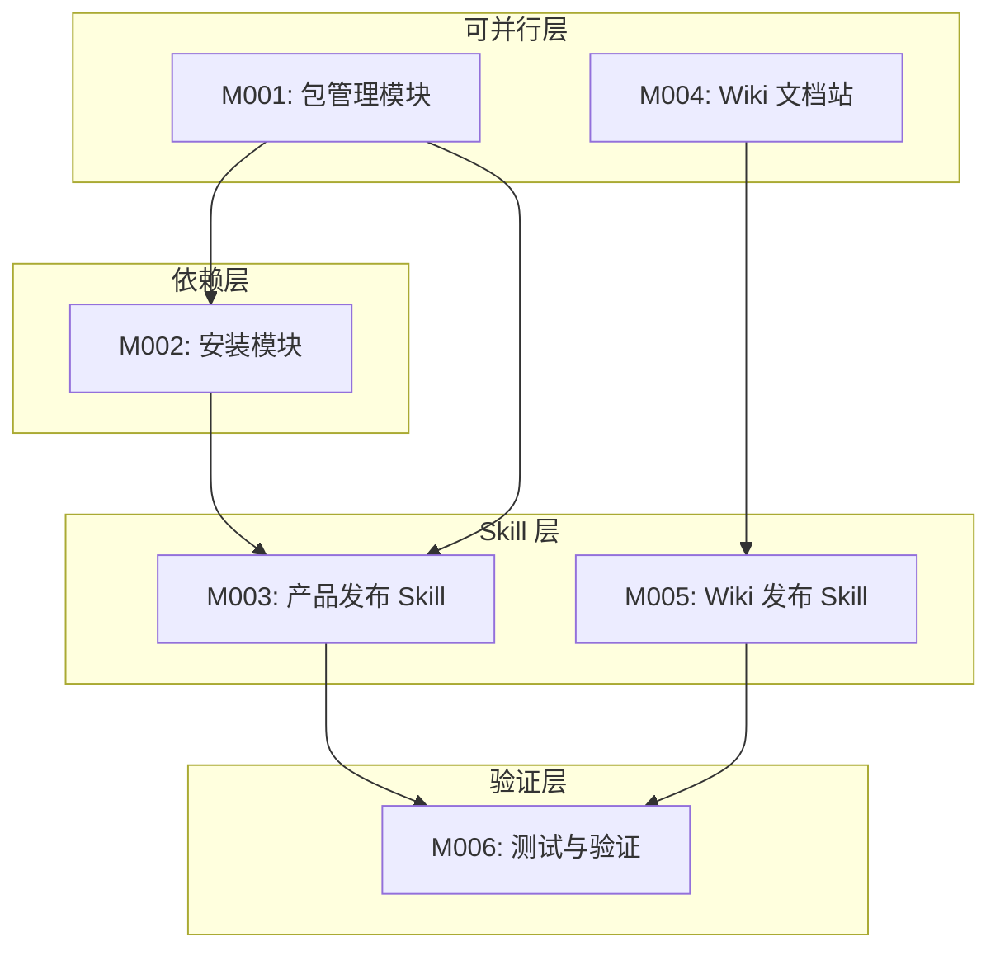

# P5-编码计划

> **For Claude:** REQUIRED SUB-SKILL: Use ideal-dev-exec to implement this plan task-by-task.

**Goal:** 构建 ideal-best-practice 发布体系，包含包管理、安装脚本、两个通用 Skills、Docusaurus 文档站和测试验证。

**Architecture:** 采用分层架构，包管理层提供元数据规范，安装层提供跨平台安装能力，Skill 层提供产品发布和 Wiki 发布的自动化流程，展示层提供 Docusaurus 文档站。

**Tech Stack:** JSON（元数据）、Bash/PowerShell（安装脚本）、Docusaurus（文档站）、GitHub Pages（托管）

---

## 模块总览

| 模块 | 内容 | 任务数 | 执行策略 | 依赖 |
|------|------|--------|----------|------|
| M001 | 包管理模块 | 5 | parallel | - |
| M002 | 安装模块 | 6 | sequential | M001 |
| M003 | 产品发布 Skill | 4 | sequential | M001, M002 |
| M004 | Wiki 文档站模块 | 5 | parallel | - |
| M005 | Wiki 发布 Skill | 4 | sequential | M004 |
| M006 | 测试与验证 | 4 | sequential | M001-M005 |

**总任务数：28**

---

## 依赖关系



---

## 执行顺序

```
批次 1（并行）: M001 + M004
批次 2（顺序）: M002（依赖 M001）
批次 3（并行）: M003（依赖 M001, M002）+ M005（依赖 M004）
批次 4（顺序）: M006（依赖全部）
```

---

## 模块详情

### M001: 包管理模块

**目标**: 创建发布仓库目录结构、定义 JSON Schema

**产出文件**:
- `ideal-best-practice/registry.json`
- `ideal-best-practice/packages/ideal-dev/manifest.json`
- `ideal-best-practice/packages/ideal-dev/skills/` 目录
- `ideal-best-practice/packages/ideal-dev/agents/` 目录

**任务列表**:

#### 任务 M001-1: 创建发布仓库目录结构
- [ ] 创建 `ideal-best-practice/` 根目录
- [ ] 创建 `packages/ideal-dev/` 子目录
- [ ] 创建 `install/` 子目录
- [ ] 创建 `wiki/` 子目录
- [ ] 验证目录结构完整性

**验证标准**: 目录结构与 P3 技术方案 4.2 节一致

---

#### 任务 M001-2: 创建 registry.json
- [ ] 定义 registry.json Schema
- [ ] 添加 version 字段（注册表格式版本）
- [ ] 添加 updated 字段（更新日期）
- [ ] 添加 packages 数组
- [ ] 添加 ideal-dev 包条目

**验证标准**: JSON 格式有效，符合 Schema 定义

---

#### 任务 M001-3: 创建 manifest.json
- [ ] 定义 manifest.json Schema
- [ ] 添加包基本信息（name, version, prefix, description）
- [ ] 扫描并添加 skills 列表
- [ ] 扫描并添加 agents 列表
- [ ] 添加兼容性信息

**验证标准**: JSON 格式有效，skills/agents 列表完整

---

#### 任务 M001-4: 复制 Skills 定义文件
- [ ] 遍历 `.claude/skills/` 目录
- [ ] 复制每个 skill 目录到 `packages/ideal-dev/skills/`
- [ ] 保留完整目录结构（SKILL.md, scripts/, references/）
- [ ] 验证文件完整性

**验证标准**: 所有 skill 目录已复制，文件完整

---

#### 任务 M001-5: 复制 Agents 定义文件
- [ ] 遍历 `.claude/agents/` 目录
- [ ] 复制所有 `.md` 文件到 `packages/ideal-dev/agents/`
- [ ] 验证文件完整性

**验证标准**: 所有 agent 文件已复制

---

### M002: 安装模块

**目标**: 开发跨平台安装脚本（Unix + Windows）

**产出文件**:
- `ideal-best-practice/install/install.sh`
- `ideal-best-practice/install/install.ps1`

**任务列表**:

#### 任务 M002-1: 开发 install.sh 核心框架
- [ ] 定义脚本头部（shebang, 描述）
- [ ] 实现参数解析函数
- [ ] 实现帮助信息显示
- [ ] 实现版本信息显示
- [ ] 测试基本参数解析

**验证标准**: `./install.sh --help` 正确显示帮助信息

---

#### 任务 M002-2: 实现网络请求和包获取
- [ ] 实现 fetch_registry 函数（获取 registry.json）
- [ ] 实现 fetch_manifest 函数（获取 manifest.json）
- [ ] 添加网络错误处理
- [ ] 添加超时处理
- [ ] 测试网络请求功能

**验证标准**: 能正确获取远程 registry.json

---

#### 任务 M002-3: 实现文件下载和安装
- [ ] 实现 download_package 函数
- [ ] 实现 install_skills 函数（复制到 ~/.claude/skills/）
- [ ] 实现 install_agents 函数（复制到 ~/.claude/agents/）
- [ ] 添加权限处理
- [ ] 测试安装流程

**验证标准**: 安装后 skills 可在 Claude Code 中使用

---

#### 任务 M002-4: 实现错误处理和回滚
- [ ] 定义错误码（网络错误、包不存在、权限不足等）
- [ ] 实现 rollback 函数（安装失败时清理）
- [ ] 添加详细错误信息
- [ ] 实现日志记录
- [ ] 测试错误场景

**验证标准**: 各错误场景有正确错误码和信息

---

#### 任务 M002-5: 开发 install.ps1（Windows 版本）
- [ ] 转换 install.sh 核心逻辑为 PowerShell
- [ ] 实现 PowerShell 参数解析
- [ ] 实现 WebClient/Invoke-WebRequest 下载
- [ ] 实现 Windows 路径处理（$env:USERPROFILE）
- [ ] 测试 Windows 安装流程

**验证标准**: Windows 上能正确安装

---

#### 任务 M002-6: 测试跨平台兼容性
- [ ] 在 macOS 上测试 install.sh
- [ ] 在 Linux 上测试 install.sh
- [ ] 在 Windows 上测试 install.ps1
- [ ] 验证安装后 Claude Code 可识别 skills
- [ ] 记录测试结果

**验证标准**: 三个平台安装均成功

---

### M003: 产品发布 Skill（ideal-product-release）

**目标**: 调用 /writing-skills 创建通用产品发布 Skill

**产出文件**:
- `.claude/skills/ideal-product-release/SKILL.md`
- `.claude/skills/ideal-product-release/scripts/`
- `.claude/skills/ideal-product-release/references/`

**任务列表**:

#### 任务 M003-1: 准备 Skill 需求文档
- [ ] 从 P3 技术方案提取 Skill 职责
- [ ] 整理 Skill 工作流程（5 步）
- [ ] 定义 Skill 配置项
- [ ] 定义 Skill Agents
- [ ] 整理成需求文档

**验证标准**: 需求文档完整，包含职责、工作流、配置项

---

#### 任务 M003-2: 调用 /writing-skills 创建 Skill
- [ ] 调用 /writing-skills
- [ ] 提供 Skill 用途描述
- [ ] 提供 Skill 工作流程
- [ ] 提供配置项需求
- [ ] 确认生成的 SKILL.md

**验证标准**: SKILL.md 生成成功

---

#### 任务 M003-3: 验证 Skill 脚本
- [ ] 检查 version-bump.sh 脚本
- [ ] 检查 generate-manifest.py 脚本
- [ ] 检查 update-registry.py 脚本
- [ ] 检查 deploy.sh 脚本
- [ ] 检查 rollback.sh 脚本

**验证标准**: 所有脚本存在且语法正确

---

#### 任务 M003-4: 集成 Skill 到项目
- [ ] 将 Skill 放入 `.claude/skills/ideal-product-release/`
- [ ] 更新 CLAUDE.md 的 Skills 索引
- [ ] 测试 Skill 可被 Claude Code 识别
- [ ] 记录集成结果

**验证标准**: `/ideal-product-release` 可被调用

---

### M004: Wiki 文档站模块

**目标**: 配置 Docusaurus 文档站，创建基础文档结构

**产出文件**:
- `ideal-best-practice/wiki/docusaurus.config.js`
- `ideal-best-practice/wiki/package.json`
- `ideal-best-practice/wiki/sidebars.js`
- `ideal-best-practice/wiki/docs/` 文档文件

**任务列表**:

#### 任务 M004-1: 初始化 Docusaurus 项目
- [ ] 创建 wiki/ 目录
- [ ] 创建 package.json（Docusaurus 依赖）
- [ ] 创建 docusaurus.config.js 配置文件
- [ ] 创建 sidebars.js 侧边栏配置
- [ ] 运行 npm install 验证

**验证标准**: `npm run start` 能启动开发服务器

---

#### 任务 M004-2: 配置产品主页
- [ ] 创建 src/pages/index.js
- [ ] 设计 Hero 区域（标题、描述、安装命令）
- [ ] 添加 Features 区域（4 个特性）
- [ ] 添加 Quick Start 区域
- [ ] 添加 Footer

**验证标准**: 主页渲染正确

---

#### 任务 M004-3: 创建文档结构
- [ ] 创建 docs/intro.md（简介）
- [ ] 创建 docs/getting-started/installation.md
- [ ] 创建 docs/getting-started/quick-start.md
- [ ] 创建 docs/user-guide/workflow.md
- [ ] 创建 docs/user-guide/skills.md

**验证标准**: 侧边栏导航正常，文档可访问

---

#### 任务 M004-4: 创建 API 参考文档
- [ ] 创建 docs/api/install-script.md
- [ ] 创建 docs/api/registry-schema.md
- [ ] 创建 docs/api/manifest-schema.md
- [ ] 创建 docs/api/product-release.md
- [ ] 创建 docs/api/wiki-release.md

**验证标准**: API 文档结构完整

---

#### 任务 M004-5: 配置 GitHub Pages 部署
- [ ] 配置 docusaurus.config.js 中的 url 和 baseUrl
- [ ] 配置 organizationName 和 projectName
- [ ] 创建部署脚本
- [ ] 测试 npm run build
- [ ] 验证构建输出

**验证标准**: `npm run build` 成功，输出到 build/ 目录

---

### M005: Wiki 发布 Skill（ideal-wiki-release）

**目标**: 调用 /writing-skills 创建通用 Wiki 发布 Skill

**产出文件**:
- `.claude/skills/ideal-wiki-release/SKILL.md`
- `.claude/skills/ideal-wiki-release/scripts/`
- `.claude/skills/ideal-wiki-release/references/`

**任务列表**:

#### 任务 M005-1: 准备 Skill 需求文档
- [ ] 从 P3 技术方案提取 Skill 职责
- [ ] 整理 Skill 工作流程（5 步）
- [ ] 定义 Skill 配置项（docs.framework, deploy.branch 等）
- [ ] 定义 Skill Agents
- [ ] 整理成需求文档

**验证标准**: 需求文档完整

---

#### 任务 M005-2: 调用 /writing-skills 创建 Skill
- [ ] 调用 /writing-skills
- [ ] 提供 Skill 用途描述
- [ ] 提供 Skill 工作流程
- [ ] 提供配置项需求
- [ ] 确认生成的 SKILL.md

**验证标准**: SKILL.md 生成成功

---

#### 任务 M005-3: 验证 Skill 脚本
- [ ] 检查 build-docs.sh 脚本
- [ ] 检查 update-homepage.py 脚本
- [ ] 检查 deploy-pages.sh 脚本
- [ ] 检查 validate-links.py 脚本
- [ ] 检查 generate-sitemap.py 脚本

**验证标准**: 所有脚本存在且语法正确

---

#### 任务 M005-4: 集成 Skill 到项目
- [ ] 将 Skill 放入 `.claude/skills/ideal-wiki-release/`
- [ ] 更新 CLAUDE.md 的 Skills 索引
- [ ] 测试 Skill 可被 Claude Code 识别
- [ ] 记录集成结果

**验证标准**: `/ideal-wiki-release` 可被调用

---

### M006: 测试与验证

**目标**: 端到端测试，验证发布体系完整性

**任务列表**:

#### 任务 M006-1: 安装脚本端到端测试
- [ ] 在干净环境测试 install.sh
- [ ] 验证 skills 安装到正确位置
- [ ] 验证 agents 安装到正确位置
- [ ] 验证 Claude Code 可识别安装的 skills
- [ ] 记录测试结果

**验证标准**: 安装流程完整可用

---

#### 任务 M006-2: 产品发布 Skill 测试
- [ ] 调用 /ideal-product-release --dry-run
- [ ] 验证版本管理逻辑
- [ ] 验证 manifest/registry 生成
- [ ] 验证部署流程（模拟）
- [ ] 验证回滚机制

**验证标准**: Skill 工作流程正确

---

#### 任务 M006-3: Wiki 发布 Skill 测试
- [ ] 调用 /ideal-wiki-release --dry-run
- [ ] 验证文档构建流程
- [ ] 验证主页更新逻辑
- [ ] 验证部署流程（模拟）
- [ ] 验证链接检查

**验证标准**: Skill 工作流程正确

---

#### 任务 M006-4: 完整发布流程验证
- [ ] 执行完整 P14-P17 流程模拟
- [ ] 验证产品资源发布
- [ ] 验证 Wiki 站点部署
- [ ] 验证 GitHub Pages 可访问
- [ ] 生成测试报告

**验证标准**: 完整流程无阻塞

---

## 验证计划

### 完整流程验证

1. **安装验证**：用户通过 install.sh/install.ps1 安装 ideal-dev 包
2. **Skill 验证**：安装后可调用 `ideal-dev:requirement` 等 skills
3. **发布验证**：P14 调用 ideal-product-release 成功发布
4. **Wiki 验证**：P17 调用 ideal-wiki-release 成功部署

### 验收标准

| 验收项 | 验证方法 |
|--------|----------|
| 目录结构正确 | 与 P3 技术方案对比 |
| registry.json 有效 | JSON 校验 + 手动检查 |
| manifest.json 有效 | JSON 校验 + 手动检查 |
| install.sh 可执行 | macOS/Linux 实际运行 |
| install.ps1 可执行 | Windows 实际运行 |
| ideal-product-release 可调用 | Claude Code 测试 |
| ideal-wiki-release 可调用 | Claude Code 测试 |
| Docusaurus 构建成功 | npm run build 无错误 |

---

*文档版本: v1.0*
*创建时间: 2026-02-21*
*作者: Claude Code*
