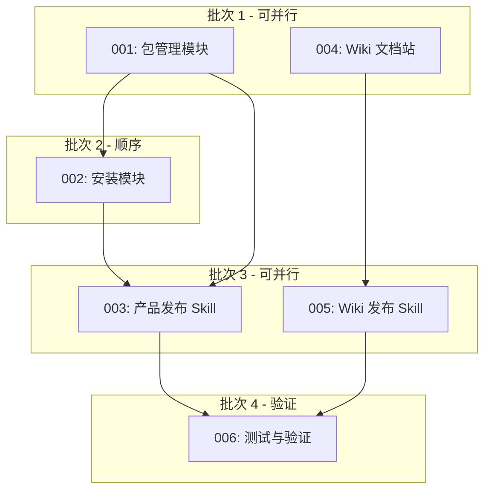

# 故事索引

## 概览

| 故事 | 标题 | 状态 | 依赖 | 任务数 |
|------|------|------|------|--------|
| [001](001-包管理模块.md) | 包管理模块 - 发布仓库结构和元数据 | ⏳ 待开始 | - | 5 |
| [002](002-安装模块.md) | 安装模块 - 跨平台安装脚本 | ⏳ 待开始 | 001 | 6 |
| [003](003-产品发布Skill.md) | 产品发布 Skill - ideal-product-release | ⏳ 待开始 | 001, 002 | 4 |
| [004](004-Wiki文档站模块.md) | Wiki 文档站模块 - Docusaurus 配置 | ⏳ 待开始 | - | 5 |
| [005](005-Wiki发布Skill.md) | Wiki 发布 Skill - ideal-wiki-release | ⏳ 待开始 | 004 | 4 |
| [006](006-测试与验证.md) | 测试与验证 - 端到端测试 | ⏳ 待开始 | 001-005 | 4 |

**总任务数：28**

---

## 依赖关系

---

## 执行顺序

### 批次 1（可并行）
- **001**: 包管理模块（5 任务）- 创建发布仓库结构和元数据
- **004**: Wiki 文档站模块（5 任务）- 配置 Docusaurus

### 批次 2（顺序，依赖 001）
- **002**: 安装模块（6 任务）- 开发跨平台安装脚本

### 批次 3（可并行）
- **003**: 产品发布 Skill（4 任务）- 调用 /writing-skills 创建
- **005**: Wiki 发布 Skill（4 任务）- 调用 /writing-skills 创建

### 批次 4（验证）
- **006**: 测试与验证（4 任务）- 端到端测试

---

## 时间估算

| 批次 | 串行时间 | 并行时间 | 说明 |
|------|----------|----------|------|
| 批次 1 | 10 任务 | 5 任务 | 001 和 004 并行 |
| 批次 2 | 6 任务 | 6 任务 | 顺序执行 |
| 批次 3 | 8 任务 | 4 任务 | 003 和 005 并行 |
| 批次 4 | 4 任务 | 4 任务 | 验证阶段 |
| **总计** | **28 任务** | **19 任务** | **节省 9 任务时间** |

---

## 状态说明

- ⏳ 待开始：故事尚未开始
- 🔄 进行中：故事正在执行
- ✅ 已完成：故事已完成验收
- ❌ 已阻塞：故事被阻塞

---

*创建时间: 2026-02-21*
*作者: Claude Code*
